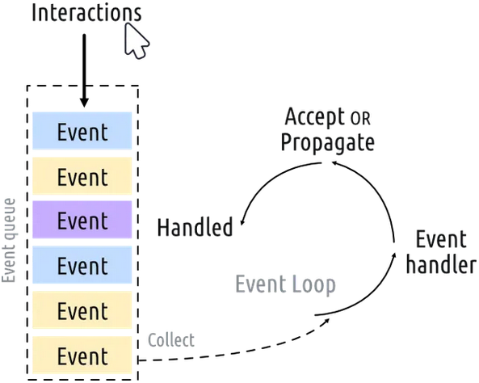
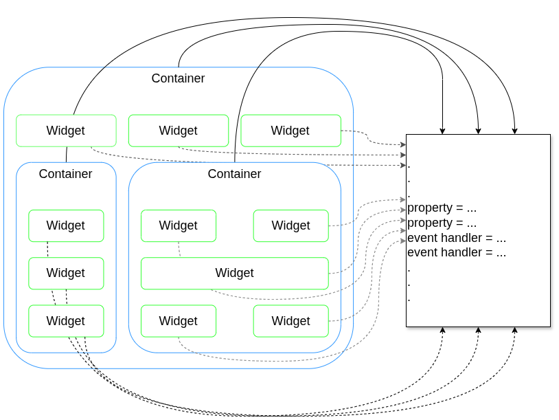

# Aula 01

<style>
    h1 { font-size: 2.5em; }
    h2 { font-size: 2.25em;}
    h3 { font-size: 2em;   }
    h4 { font-size: 1.75em;}
    h5 { font-size: 1.5em; }
    h6 { font-size: 1.25em;}
</style>

**Sumário**

- [Aula 01](#aula-01)
  - [Qt](#qt)
    - [PyQt vs PySide \[7\]](#pyqt-vs-pyside-7)
    - [Instalação](#instalação)
  - [Primeiro app com PySide6](#primeiro-app-com-pyside6)
    - [Criando uma aplicação](#criando-uma-aplicação)
      - [Entendendo o código, passo-a-passo](#entendendo-o-código-passo-a-passo)
    - [Loop de eventos](#loop-de-eventos)
    - [Esquema geral](#esquema-geral)
  - [Janelas](#janelas)
    - [`QMainWindow`](#qmainwindow)
    - [Ajustanto as propriedades dos `widgets`](#ajustanto-as-propriedades-dos-widgets)
  - [Sinais \& Slots](#sinais--slots)
    - [Sinais do `QPushButton`](#sinais-do-qpushbutton)
    - [Recebendo dados](#recebendo-dados)
    - [Modificando a interface](#modificando-a-interface)
    - [Conectando `widgets` diretamente](#conectando-widgets-diretamente)
  - [Exercícios](#exercícios)
    - [`Signals`](#signals)
      - [Fácil](#fácil)
      - [Médio](#médio)
      - [Difícil](#difícil)
    - [`Slots`](#slots)
      - [Fácil](#fácil-1)
      - [Médio](#médio-1)
      - [Difícil](#difícil-1)

## Qt

[``Qt``](https://www.qt.io/development/qt-framework) (pronúncia: *cute*) é um framework para aplicações em C++, multiplataforma (*cross-platform*) e modular, projetado para o desenvolvimento de interfaces gráficas de usuário (GUI) e componentes de software a serem implantados em plataformas desktop, mobile, embutidos e web com o mínimo de ajustes no código da plataforma [[1]](https://grokipedia.com/page/Qt_(software))[[2]](https://www.qt.io/development/qt-framework)[[3]](https://doc.qt.io/qt-6/get-and-install-qt.html).

Teve seu início em 1991 de um projeto dos desenvolvedores Haavard Nord e Eirick Chambe-Eng na empresa Trolltech. Seu primeiro lançamento público ocorreu em 1995 e sua evolução ocorreu através da mudança de donos: a Nokia adquiriu a Trolltech em 2008 e depois vendeu para a Digia em 2012; em 2014 a Digia transferiu todo o negócio do Qt para sua subsidiária The Qt Company, e em 2016 passaram a ser 2 empresas separadas [[1]](https://grokipedia.com/page/Qt_(software))[[4]](https://extenly.com/2024/12/20/from-qtwidgets-to-qt6-and-beyond-what-is-qt-capable-of/)[[5]](https://machaddr.substack.com/p/history-of-qt-software)[[6]](https://en.wikipedia.org/wiki/Qt_(software)#Acquisition_by_Nokia).

### PyQt vs PySide [[7]](https://www.pythonguis.com/faq/pyqt6-vs-pyside6/)

PyQt6 e PySide6 são duas bibliotecas em Python para a utilização do framework Qt.

A primeira a ser implementada foi o PyQt, pelo desenvolvedor Phil Thompson da [Riverbank Computing](https://www.riverbankcomputing.com/software/pyqt/intro). Em 2009 a Nokia decidiu criar uma biblioteca em Python para o Qt sob uma lincensa mais permissiva. O PyQt é distribuído sob a linceça [GPL](https://www.gnu.org/licenses/licenses.pt-br.html) [[8]](https://grokipedia.com/page/GNU_General_Public_License)[[9]](https://pt.wikipedia.org/wiki/GNU_General_Public_License), enquanto o PySide é distribuído sob a licença [LGPL](https://www.gnu.org/licenses/lgpl-3.0.html) [[10]](https://grokipedia.com/page/GNU_Lesser_General_Public_License)[[11]](https://pt.wikipedia.org/wiki/GNU_Lesser_General_Public_License).

De início o PyQt era atualizado mais rapidamente à medida em que o Qt evoluía, porém o Qt Project adotou o PySide como o oficial Atualmente, ambas as bibliotecas são quase idênticas e para a maioria dos casos não importa qual das duas é utilizada. Além da licença, outras diferenças entre as bibliotecas podem ser vistas na referência [[7]](https://www.pythonguis.com/faq/pyqt6-vs-pyside6/).

Para a disciplina utilizaremos a biblioteca `PySide6`.

### Instalação

Primeiro crie um ambiente virtual e, com o ambiente ativado, basta escrever no terminal:

```shell
>>> pip install pyside6
```

## Primeiro app com PySide6

Vamos seguir os tutoriais do [Python GUIs](https://www.pythonguis.com/tutorials/pyside6-creating-your-first-window/).

A documentação referência pode ser encontrado [aqui](https://doc.qt.io/qtforpython-6/).

### Criando uma aplicação

O código-fonte para uma aplicação simples é mostrado a seguir ([exemplo 01](exemplos/exemplo01.py)):

```python
from PySide6.QtWidgets import QApplication, QWidget

# Necessário apenas para o acesso a argumentos de comando de linha
import sys

# Só é preciso 1, e somente 1, instância de QApplication por aplicação.
# Passar o sys.argv serve para permitir que o aplicativo acesse argumentos de linha de comando.
# Se não for necessário, pode passar uma lista vazia: QApplication([])
app = QApplication(sys.argv)

# Criar uma janela, que é um widget
window = QWidget()
window.show() # Janelas não são visíveis por padrão, então precisamos mostrar a janela.

# Iniciar o loop de eventos da aplicação. O programa ficará aqui até que a janela seja fechada.
app.exec()
```

#### Entendendo o código, passo-a-passo

- **Linha 1**
  - As classes [`QApplication`](https://doc.qt.io/qtforpython-6/PySide6/QtWidgets/QApplication.html) e [`QWidget`](https://doc.qt.io/qtforpython-6/PySide6/QtWidgets/QWidget.html) são importadas a partir do módulo [`QWidgets`](https://doc.qt.io/qtforpython-6/PySide6/QtWidgets/index.html).
  - **Importante**: os módulos principais (referidos como *basic modules*) são [`Qt Core`](https://doc.qt.io/qtforpython-6/PySide6/QtCore/index.html#module-PySide6.QtCore), [`QtGui`](https://doc.qt.io/qtforpython-6/PySide6/QtGui/index.html#module-PySide6.QtGui) e [`QWidgets`](https://doc.qt.io/qtforpython-6/PySide6/QtWidgets/index.html).
- **Linha 9**
  - É criada uma instância de `QApplication`, com `sys.argv` como argumento.
  - O `sys.argv` consiste em uma lista de strings contendo argumentos customizados de CLI. Exemplo (executando um arquivo chamado pyside_app):
    - `>>> python pyside_app.py --log log.txt` $\rightarrow$ onde `--log` é um argumento/comando de CLI criado pelo usuário para armazenar informações em um arquivo de texto (`log.txt`).
    - A customização desses argumentos/comandos pode ser feita com [`QCommandLineOption`](https://doc.qt.io/qtforpython-6/PySide6/QtCore/QCommandLineOption.html) e [`QCommandLineParser`](https://doc.qt.io/qtforpython-6/PySide6/QtCore/QCommandLineParser.html#PySide6.QtCore.QCommandLineParser), ambos do módulo [`Qt Core`](https://doc.qt.io/qtforpython-6/PySide6/QtCore/index.html#module-PySide6.QtCore).
- **Linha 12**
  - É criada uma instância de `QWidget`.
  - **Importante**: para o `Qt` todos os widgets que não têm um nó pai são janelas.
- **Linha 13**
  - Configurando o widget `window` para visível.
  - **Importante**: para o `Qt` todos os widgets que não possuem um nó pai são invisíveis por padrão.
- **Linha 16**
  - Iniciando o loop de eventos.

### Loop de eventos

<figure style="text-align:center;">
    
</figure>

### Esquema geral

O esquema geral de uma aplicação gráfica, incluindo o `PySide6`, em um contexto **orientado a objetos**, é ter uma *container* como objeto maior, composto por `widgets` ou outros *containers*, também como objetos. É importante frisar que os *containers* são, eles próprios, instâncias de `widgets`.

O código vai consistir, geralmente em: 

1. Instanciação das classes nativas do `Qt`, ou na criação de novas classes a partir das nativas.
2. Ajuste das propriedades de cada classe (tamanho, cor, formato, comportamento, etc.).
3. Manipulação da comunicação entre os objetos.

<figure style="text-align:center;">
    
</figure>

## Janelas

Para o `Qt` **qualquer widget sem um nó pai** é tratado como uma janela. [Exemplo 2](exemplos/exemplo02.py):

```python
from PySide6.QtWidgets import QApplication, QPushButton
import sys

app = QApplication(sys.argv)

window = QPushButton("Clique aqui")
window.show()

app.exec()
```

Uma interface pode ser criada com a criação de `widgets` aninhados em outros `widgets` (como vimos no [Esquema geral](#esquema-geral)).

### `QMainWindow`

Contudo, considerando-se que normalmente construimos uma janela principal, o `Qt` possui a classe nativa [`QMainWindow`](https://doc.qt.io/qtforpython-6/PySide6/QtWidgets/QMainWindow.html), a qual fornece várias *features* padrões para janelas, incluindo barra de ferramentas, menu, barra de status, etc.

Por conveniência, vamos seguir com esse `widget`. [Exemplo 3](exemplos/exemplo03.py):

```python
import sys
from PySide6.QtWidgets import QApplication, QMainWindow, QPushButton

class MainWindow(QMainWindow):
    def __init__(self):
        super().__init__()

        self.setWindowTitle("Meu querido primeiro aplicativo")

        button = QPushButton("Clique aqui")
        # Configurando o widget central da janela principal para ser o botão
        self.setCentralWidget(button)
        
app = QApplication(sys.argv)
    
window = MainWindow()
window.show()

app.exec()
```

### Ajustanto as propriedades dos `widgets`

Por enquanto, nos exemplos que vimos, a janela pode ser dimensionada livremente. Mas podemos configurar suas dimensões iniciais e se é permitido, ou não, redmiensioná-la, etc. As propriedades são todas, ou quase todas, herdadas da classe [`QWidget`](https://doc.qt.io/qtforpython-6/PySide6/QtWidgets/QWidget.html). [Exemplo 4](exemplos/exemplo04.py):

```python
import sys
from PySide6.QtCore import QSize
from PySide6.QtWidgets import QApplication, QMainWindow, QPushButton

class MainWindow(QMainWindow):
    def __init__(self):
        super().__init__()

        self.setWindowTitle("Meu querido aplicativo")
        self.setFixedSize(QSize(400, 300))
        # Descomente as linhas abaixo para permitir redimensionamento da janela
        # self.setMinimumHeight(200)
        # self.setMinimumWidth(300)
        # self.setMaximumHeight(600)
        # self.setMaximumWidth(800)

        button = QPushButton("Clique aqui")
        # Configurando o widget central da janela principal para ser o botão
        self.setCentralWidget(button)
        
app = QApplication(sys.argv)

window = MainWindow()
window.show()

app.exec()
```

## Sinais & Slots

**Sinais** (`signals`) são notificações emitidas por widgets quando **evento** acontece. Esse **evento** pode ser qualquer coisa como clicar em um botão, a modificação do texto de um campo, ou da janela, etc. Vários sinais, mas não todos, são iniciados pela ação do usuário.

Além da notificação, um **sinal** pode também enviar dados que fornecem contexto adicional sobre o **evento** que aconteceu.

Os `slots` são os *recebedores* dos **sinais**. Qualquer função, ou método, pode ser usado como um `slot` se um **sinal** é conectado a ele. Se o **sinal** envia dados, a função/método vai receber esses dados. 

Além disso, vários `widgets` possuem seus próprios `slots` nativos. Vejamos alguns exemplos.

### Sinais do `QPushButton`

```python
import sys
from PySide6.QtWidgets import QApplication, QMainWindow, QPushButton

class MainWindow(QMainWindow):
    def __init__(self):
        super().__init__()

        self.setWindowTitle("Meu Aplicativo Querido")

        button = QPushButton("Clique Aqui!")
        button.setCheckable(True)
        button.clicked.connect(self.botao_clicado)

        # Configurando o widget central da janela principal para ser o botão
        self.setCentralWidget(button)

    def botao_clicado(self):
        print("Clicado!")

app = QApplication(sys.argv)

window = MainWindow()
window.show()

app.exec()
```

### Recebendo dados

**Lembrando**: os sinais podem enviar dados também!

Na **linha 11** temos o seguinte: `button.setCheckable(True)`. Com isso estamos dando ao botão um estado de **ligado** ou **desligado**. Por padrão, os botões costumam ter o `setCheckable` como `False` porque botões geralmente são somente pressionados, em vez de estarem ligados ou desligados.

Vamos aproveitar essa linha de código e criar um novo `slot` para verificar o envio de dados. [Exemplo 5](exemplos/exemplo05.py):

```python
import sys
from PySide6.QtWidgets import QApplication, QMainWindow, QPushButton

class MainWindow(QMainWindow):
    def __init__(self):
        super().__init__()

        self.setWindowTitle("Meu Aplicativo Querido")

        button = QPushButton("Clique Aqui!")
        button.setCheckable(True)
        button.clicked.connect(self.botao_clicado)
        button.clicked.connect(self.botao_ligado)

        # Configurando o widget central da janela principal para ser o botão
        self.setCentralWidget(button)

    def botao_clicado(self):
        print("Botão clicado!")

    def botao_ligado(self, estado):
        if estado:
            print("Botão ligado!")
        else:
            print("Botão desligado!")


app = QApplication(sys.argv)

window = MainWindow()
window.show()

app.exec()
```

É possível **armazenar valores** sem a necessidade de acessar o `widget`. A depender da situação, os valores podem ser armazenados em variáveis distintas, ou qualquer outro tipo de estrutura de dados, como um dicionário.

### Modificando a interface

Até então estivemos apenas mostrando o valor do sinal no terminal. Agora vamos utilizar o `slot` para modificar a interface. [Exemplo 6](exemplos/exemplo06.py):

```python
import sys
from PySide6.QtWidgets import QApplication, QMainWindow, QPushButton

class MainWindow(QMainWindow):
    def __init__(self):
        super().__init__()

        self.setWindowTitle("Meu Aplicativo Querido")
        self.setFixedWidth(400)

        # Perceba que agora o botão é um atributo de MainWindow
        self.button = QPushButton("Clique Aqui!")
        self.button.clicked.connect(self.botao_clicado)

        self.setCentralWidget(self.button)

    def botao_clicado(self):
        self.button.setText("Você já clicou!")
        self.button.setEnabled(False)  # Desabilita o botão após o clique
        
        self.setWindowTitle("Meu Aplicativo de 1 clique só!")


app = QApplication(sys.argv)

window = MainWindow()
window.show()

app.exec()
```

### Conectando `widgets` diretamente

Um `signal` disparado por um `widget` pode produzir efeitos em outro `widget`, ou um efeito em cascata, ou seja, sobre vários `widgets`. Vejamos o [exemplo 7](exemplos/exemplo07.py):

```python
import sys
from PySide6.QtWidgets import QApplication, QMainWindow, QLabel, QLineEdit, QVBoxLayout, QWidget

class MainWindow(QMainWindow):
    def __init__(self):
        super().__init__()

        self.setWindowTitle("Meu Lindo Aplicativo")
        self.setFixedWidth(600)
        
        self.label = QLabel()
        
        self.input = QLineEdit()
        self.input.textChanged.connect(self.label.setText)
        
        layout = QVBoxLayout() # Vamos ver sobre layout em outra aula
        layout.addWidget(self.input)
        layout.addWidget(self.label)
        
        containter = QWidget()
        containter.setLayout(layout)
        
        self.setCentralWidget(containter)

app = QApplication(sys.argv)

window = MainWindow()
window.show()

app.exec()
```

Um pouco da referência do [`QLabel`](https://doc.qt.io/qtforpython-6/PySide6/QtWidgets/QLabel.html):

- `Signals`
  - `linkActivated()`
  - `linkHovered()`
- `Slots`
  - `clear()`
  - `setMovie()`
  - `setNum()`
  - `setPicture()`
  - `setPixmap()`
  - `setText()`

## Exercícios

### `Signals`

#### Fácil

1. Crie uma classe personalizada que herde de QObject e defina um sinal simples sem parâmetros chamado `meuSinal`.
2. Em uma aplicação PySide6, emita um sinal `clicked` de um QPushButton ao clicar nele, sem conectar a nenhum slot.
3. Defina um sinal com um parâmetro inteiro em uma classe customizada e emita-o com o valor 42.
4. Crie um sinal que envie uma string como parâmetro e emita-o com a mensagem "Olá, mundo!".
5. Use o sinal `valueChanged` de um QSlider e emita-o manualmente com um valor específico.
6. Defina um sinal booleano em uma classe e emita true e false alternadamente.
7. Crie um sinal que envie uma lista como parâmetro e emita uma lista vazia.
8. Em uma janela principal, defina um sinal personalizado e emita-o no método `__init__`.
9. Use o sinal `textChanged` de um QLineEdit e emita-o com uma string vazia.
10. Crie um sinal que envie um dicionário como parâmetro e emita um dicionário com uma chave-valor simples.
11. Defina um sinal sem parâmetros e emita-o em resposta a um temporizador (usando QTimer).
12. Emita o sinal `currentIndexChanged` de um QComboBox manualmente com índice 0.
13. Crie um sinal que envie um float e emita-o com o valor 3.14.
14. Use um sinal personalizado para notificar mudanças em uma variável de instância.
15. Defina um sinal que envie um objeto personalizado como parâmetro e emita um objeto vazio.

#### Médio

1. Crie uma classe com múltiplos sinais (um int, uma string e um bool) e emita-os em sequência em um método.
2. Implemente um sinal que seja emitido apenas quando uma condição específica for atendida, como um contador atingir 10.
3. Use sinais para comunicar entre duas classes separadas, emitindo de uma e capturando na outra sem conexão direta.
4. Crie um sinal sobrecarregado (com diferentes assinaturas) e emita cada versão alternadamente.
5. Integre um sinal com um QThread, emitindo-o do thread para a thread principal.
6. Defina um sinal que envie uma tupla como parâmetro e emita valores variados em loop.
7. Use o sinal `stateChanged` de um QCheckBox e emita-o manualmente em um loop condicional.
8. Crie um sinal personalizado que seja emitido em resposta a uma mudança de propriedade usando @Property.
9. Implemente um sinal que envie um enum como parâmetro e emita diferentes valores do enum.
10. Use sinais para sincronizar dados entre instâncias, emitindo atualizações periódicas.

#### Difícil

1. Desenvolva um sistema de sinais customizados para um modelo de dados, emitindo sinais para inserção, remoção e atualização de itens em uma lista complexa.
2. Crie uma classe com sinais aninhados, onde a emissão de um sinal aciona a emissão de outro em cadeia, lidando com loops potenciais.
3. Integre sinais com assincronia usando QFuture, emitindo sinais baseados em resultados de computações paralelas.
4. Implemente um sinal que envie um objeto complexo (como uma classe com múltiplos atributos) e gerencie a serialização para threads seguras.
5. Desenvolva um framework de logging baseado em sinais, onde diferentes níveis de log (info, warning, error) são emitidos como sinais separados com payloads detalhados.

---

### `Slots`

#### Fácil

1. Crie um slot simples que imprima "Botão clicado!" e conecte-o ao sinal `clicked` de um QPushButton.
2. Defina um slot que receba um inteiro e o imprima, conectando ao `valueChanged` de um QSpinBox.
3. Crie um slot que receba uma string e a exiba em um QLabel, conectando ao `textChanged` de um QLineEdit.
4. Implemente um slot booleano que altere a visibilidade de um widget baseado no estado, conectando a um QCheckBox.
5. Crie um slot sem parâmetros que feche a janela, conectando ao `clicked` de um botão "Sair".
6. Defina um slot que receba um float e o formate para duas casas decimais em um label.
7. Conecte um slot a um sinal de QComboBox que imprima o índice atual.
8. Crie um slot que limpe o texto de um QTextEdit ao receber um sinal.
9. Implemente um slot que incremente um contador global e o exiba.
10. Defina um slot que receba uma lista e imprima seu comprimento.
11. Conecte um slot ao `toggled` de um QRadioButton para alternar cores de fundo.
12. Crie um slot que receba um dicionário e acesse uma chave específica.
13. Implemente um slot simples para atualizar a data atual em um label.
14. Defina um slot que receba um enum e imprima seu nome.
15. Conecte um slot ao sinal de um QTimer para atualizar um relógio.

#### Médio

1. Crie múltiplos slots e conecte-os a um mesmo sinal, executando ações sequenciais.
2. Implemente um slot que processe dados de um sinal e atualize uma tabela (QTableWidget).
3. Defina slots para sinais sobrecarregados, distinguindo por assinatura.
4. Use slots em threads separadas, garantindo thread-safety com queued connections.
5. Crie um slot que valide entrada de um sinal e rejeite valores inválidos.
6. Implemente slots para sincronizar widgets, como copiar texto de um para outro.
7. Defina um slot que manipule uma estrutura de dados complexa recebida de um sinal.
8. Use slots para gerenciar estados de uma máquina finita simples.
9. Crie slots que lidem com exceções e loguem erros de sinais.
10. Implemente um slot que atualize um gráfico (usando QChart) baseado em dados de sinal.

#### Difícil
1. Desenvolva um sistema de slots para um editor de texto, lidando com undo/redo via pilha de comandos.
2. Crie slots aninhados que respondam a cadeias de sinais, com gerenciamento de dependências.
3. Integre slots com banco de dados, atualizando registros baseados em sinais de UI.
4. Implemente slots para processamento de imagem em tempo real de sinais de webcam.
5. Desenvolva um framework de plugins onde slots são registrados dinamicamente para sinais globais.