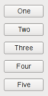
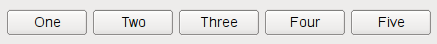
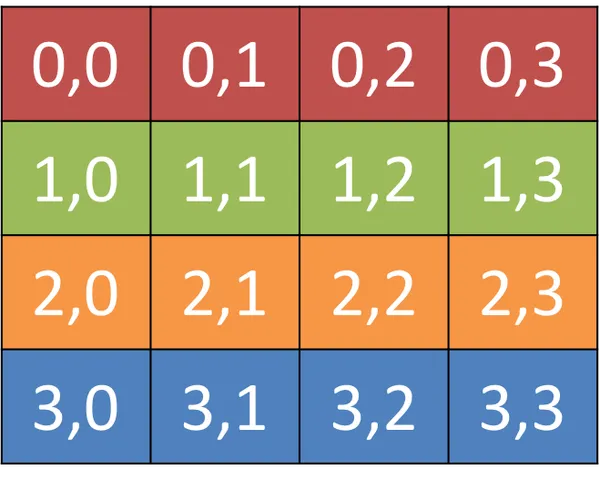
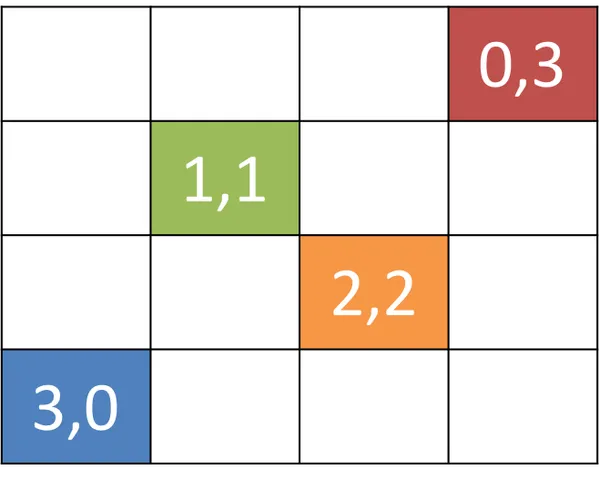

# Aula 02

<style>
    h1 { font-size: 2.5em; }
    h2 { font-size: 2.25em;}
    h3 { font-size: 2em;   }
    h4 { font-size: 1.75em;}
    h5 { font-size: 1.5em; }
    h6 { font-size: 1.25em;}
</style>

**Sumário**

- [Aula 02](#aula-02)
  - [Eventos](#eventos)
    - [Como funciona](#como-funciona)
    - [Diferenças entre `signals` e `events`](#diferenças-entre-signals-e-events)
      - [Eventos de mouse](#eventos-de-mouse)
  - [Widgets](#widgets)
  - [Layouts](#layouts)
    - [`QVBoxLayout`](#qvboxlayout)
    - [`QHBoxLayout`](#qhboxlayout)
    - [`QGridLayout`](#qgridlayout)
    - [`QStackedLayout`](#qstackedlayout)
    - [Aninhando e configurando layouts](#aninhando-e-configurando-layouts)
  - [Exercícios](#exercícios)
    - [Eventos](#eventos-1)
      - [Fácil](#fácil)
      - [Médio](#médio)
      - [Difícil (5)](#difícil-5)
    - [Widgets](#widgets-1)
      - [Fácil](#fácil-1)
      - [Médio](#médio-1)
      - [Difícil (5)](#difícil-5-1)
    - [Exercícios que envolvem os tópicos: Sinais, Slots, Eventos e Widgets](#exercícios-que-envolvem-os-tópicos-sinais-slots-eventos-e-widgets)
      - [Fácil](#fácil-2)
      - [Médio](#médio-2)
      - [Difícil](#difícil)
    - [Layouts](#layouts-1)
      - [Fácil](#fácil-3)
      - [Médio](#médio-3)
      - [Difícil](#difícil-1)


## Eventos

Todas as interações de **baixo nível** que ocorrem em uma aplicação `Qt` são **eventos**. Ou seja, são as interações do usuário que envolvem, por exemplo, o uso do mouse, teclado, etc., mas capturados pelo sistema de janelas, e não pelos `widgets` em si.

### Como funciona

O `main event loop` do `Qt` ([`exec()`](https://doc.qt.io/qtforpython-6/PySide6/QtCore/QCoreApplication.html#PySide6.QtCore.QCoreApplication.exec)) busca eventos nativos do sistema de janelas na fila de eventos (`event queue`), "traduz" eles na forma de instâncias de [`QEvent`](https://doc.qt.io/qtforpython-6/PySide6/QtCore/QEvent.html) e os envia a um [`QObject`](https://doc.qt.io/qtforpython-6/PySide6/QtCore/QObject.html#PySide6.QtCore.QObject).

As instâncias de [`QObject`](https://doc.qt.io/qtforpython-6/PySide6/QtCore/QObject.html#PySide6.QtCore.QObject) recebem os eventos ao terem sua função [`event()`](https://doc.qt.io/qtforpython-6/PySide6/QtCore/QObject.html#PySide6.QtCore.QObject.event) chamada. Essa função pode ser reimplementada em subclasses para personalizar o tratamento de eventos e adicionar [tipos de evento](https://doc.qt.io/qtforpython-6/PySide6/QtCore/QEvent.html#PySide6.QtCore.QEvent.Type). Por padrão, eventos são enviados para manipuladores de eventos (*event handlers*).

Os variados tipos de eventos são implementados por subclasses de [`QEvent`](https://doc.qt.io/qtforpython-6/PySide6/QtCore/QEvent.html).

Nos `widgets` os manipuladores de evento (*event handlers*) foram implementados como [métodos virtuais](https://doc.qt.io/qtforpython-6/PySide6/QtWidgets/QWidget.html#virtual-methods), os quais podem ser reimplementados para a personalização de tratamento de eventos que ocorram a partir da interação do usuário com um `widget` em específico. O que ocorre é o mesmo descrito alguns parágrafos acima, porém o `QObject` é um `QWidget`, e a função `event()` é um dos métodos virtuais.

Mais especificamente o `Qt` chama esses métodos passando instâncias de subclasses de `QEvent` por parâmetro.

Apesar de tanto **eventos** quanto **sinais** serem respostas à interação de um usuário, ambos são de natureza diferente.

### Diferenças entre `signals` e `events`

| **Característica** | `Signals` | `Events` |
|---|---|---|
| **Nível de abstração** | Lógica de aplicação de alto-nível | Ocorrências de sistema/hardware de baixo nível |
| **Origem** | Dentro de uma aplicação `Qt` | Gerenciador de janela, S.O., ou hardware |
| **Destino** (*Receiver*) | Qualquer método conectado (`slot`) | Um método `handler` [de evento] específico de um objeto |
| **Modelo de entrega** (*Delivery model*) | Um-para-muitos (*broadcast* para todos os `slots` conectados) | Um-para-um (passado para um `widget` específico para ser manipulado) |
| **Caso de uso** | Manipulação de um `widget` | Personalização ou construção de um `widget` |

#### Eventos de mouse

Um dos principais **eventos** sobre os widgets é o [`QMouseEvent`](https://doc.qt.io/qtforpython-6/PySide6/QtGui/QMouseEvent.html). Os **eventos** são criados para cada movimento e clique de botão em um widget. Os seguintes manipuladores estão disponíveis para lidar com os **eventos** de mouse:

| Manipulador de **evento** | Tipo de ação |
|---|---|
| `mouseMoveEvent()` | O mouse moveu |
| `mousePressEvent()` | O botão do mouse foi pressionado |
| `mouseReleaseEvent()` | O botão do mouse foi liberado |
| `mouseDoubleClickEvent()` | Clique duplo detectado |

[Exemplo](exemplos/exemplo01.py):

```python
import sys
from PySide6.QtWidgets import QApplication, QMainWindow, QLabel

class MainWindow(QMainWindow):
    def __init__(self):
        super().__init__()

        self.setWindowTitle("Meu Aplicativo de Evento")
        self.setFixedWidth(600)
        self.setMouseTracking(True) # Habilita o rastreamento do mouse mesmo sem clicar
        
        self.label = QLabel("Clique nessa janela")
        
        # É necessário habilitar o rastreamento do mouse para o label também, caso contrário, 
        # os eventos de mouse só serão capturados quando o mouse estiver sobre a janela, mas não sobre o label.
        self.label.setMouseTracking(True) # Habilita o rastreamento do mouse mesmo sem clicar
        
        self.setCentralWidget(self.label)
        
    def mouseMoveEvent(self, event):
        self.label.setText("mouseMoveEvent")
    
    def mousePressEvent(self, event): 
        self.label.setText("mousePressEvent")
    
    def mouseReleaseEvent(self, event):
        self.label.setText("mouseReleaseEvent")
    
    def mouseDoubleClickEvent(self, event):
        self.label.setText("mouseDoubleClickEvent")
        
app = QApplication(sys.argv)
window = MainWindow()
window.show()

app.exec()
```

Todos os **eventos** de mouse no `Qt` são rastreados com o objeto [`QMouseEvent`](https://doc.qt.io/qtforpython-6/PySide6/QtGui/QMouseEvent.html), e as informações do **evento** podem ser lidas com os seguintes métodos de **evento**:

| **Método** | **Retorna** |
|---|---|
| `.button()` | Botão específico que disparou o **evento** |
| `.buttons()` | Estado de todos botões do mouse |
| `.globalPos()` | Posição global na aplicação, como um `QPoint` |
| `.globalX()` | Posição X horizontal global |
| `.globalY()` | Posição Y vertical global |
| `.pos()` | Posição relativa ao widget como um `QPoint` *integer* |
| `.posF()` | Posição relativa ao widget como um `QPointF` *float* |

Esses métodos podem ser usados em um manipulador de **eventos** para responder a diferentes **eventos** diferentemente, ou ignorá-los. Os métodos posicionais fornecem informações posicionais tanto globais quanto locais como um objeto `QPoint`, enquanto os botões são reportados usando-se os tipos de botões de mouse do `Qt.MouseButton`.

[Exemplo](exemplos/exemplo02.py) a seguir: respotas diferentes de acordo com o botão do mouse (esquerdo, direito, ou do meio) clicado.

```python
import sys
from PySide6.QtCore import Qt
from PySide6.QtWidgets import QApplication, QMainWindow, QLabel

class MainWindow(QMainWindow):
    def __init__(self):
        super().__init__()

        self.setWindowTitle("Meu Aplicativo de MouseEvent")
        self.setFixedWidth(400)
        
        self.label = QLabel("Clique nessa janela")
        self.setCentralWidget(self.label)
        
    def mousePressEvent(self, event):
        if event.button() == Qt.MouseButton.LeftButton:
            self.label.setText("Botão esquerdo do mouse pressionado!")
        elif event.button() == Qt.MouseButton.RightButton:
            self.label.setText("Botão direito do mouse pressionado!")
        elif event.button() == Qt.MouseButton.MiddleButton:
            self.label.setText("Botão do meio do mouse pressionado!")
            
    def mouseReleaseEvent(self, event):
        if event.button() == Qt.MouseButton.LeftButton:
            self.label.setText("Botão esquerdo do mouse liberado!")
        elif event.button() == Qt.MouseButton.RightButton:
            self.label.setText("Botão direito do mouse liberado!")
        elif event.button() == Qt.MouseButton.MiddleButton:
            self.label.setText("Botão do meio do mouse liberado!")
            
    def mouseDoubleClickEvent(self, event):
        if event.button() == Qt.MouseButton.LeftButton:
            self.label.setText("Botão esquerdo do mouse duplamente clicado!")
        elif event.button() == Qt.MouseButton.RightButton:
            self.label.setText("Botão direito do mouse duplamente clicado!")
        elif event.button() == Qt.MouseButton.MiddleButton:
            self.label.setText("Botão do meio do mouse duplamente clicado!")
            
app = QApplication(sys.argv)

window = MainWindow()
window.show()

app.exec()
```

## Widgets

É o nome dado aos componentes de uma Interface Gráfica a qual o usuário pode interagir. Interfaces de Usuário são feitas de múltiplos widgets, organizados dentro de uma janela.

O `Qt` possui uma variada quantidade de widgets disponíveis e permite também a criação de novos widgets personalizados. A seguir, um [exemplo](exemplos/exemplo03.py) com vários `widgets`

```python
import sys
from PySide6.QtWidgets import (
    QApplication, 
    QMainWindow, 
    QCheckBox, 
    QComboBox, 
    QDateEdit, 
    QDateTimeEdit, 
    QDial, 
    QDoubleSpinBox, 
    QFontComboBox, 
    QLabel, 
    QLCDNumber, 
    QLineEdit, 
    QProgressBar, 
    QPushButton, 
    QRadioButton, 
    QSlider, 
    QSpinBox, 
    QTimeEdit,
    QVBoxLayout,
    QWidget
)

class MainWindow(QMainWindow):
    def __init__(self):
        super().__init__()

        self.setWindowTitle("Widgets do Qt")

        layout = QVBoxLayout()
        
        widgets = [QCheckBox, QComboBox, QDateEdit, QDateTimeEdit, QDial, QDoubleSpinBox, QFontComboBox, 
                   QLabel, QLCDNumber, QLineEdit, QProgressBar, QPushButton, QRadioButton, QSlider, QSpinBox, 
                   QTimeEdit]
        
        for widget in widgets:
            layout.addWidget(widget())
        
        central_widget = QWidget()
        central_widget.setLayout(layout)
        self.setCentralWidget(central_widget)
        
app = QApplication(sys.argv)

window = MainWindow()
window.show()

app.exec()
```

## Layouts

Até então (exceto o último exemplo) estivemos criando uma janela com um único widget, mas e se quisermos acrescentar vários widgets?

Para nos ajudar no controle do posicionamento dos widgtes o Qt nos fornece os seguintes layouts básicos:

- `QHBoxLayout`: para organização linear horizontal.
- `QVBoxLayout`: para organização linear vertical.
- `QGridLayout`: para organização em grade, ou tabular.
- `QStackedLayout`: para empilhar um elemento sobre o outro (no eixo `z`).

Para uma lista completa de todos os layouts, clique [aqui (layout management)](https://doc.qt.io/qtforpython-6/overviews/qtwidgets-layout.html#layout-management).

### [`QVBoxLayout`](https://doc.qt.io/qtforpython-6/PySide6/QtWidgets/QVBoxLayout.html#PySide6.QtWidgets.QVBoxLayout)

Como citado anteriormente, esse layout organiza os widgets linearmente na vertical. Sempre que um novo widget é acrescentado, ele é disposto na base da coluna.

<figure style="text-align:center;">
    
</figure>

[Exemplo](exemplos/exemplo04.py):

```python
import sys
from PySide6.QtWidgets import QApplication, QMainWindow, QWidget, QVBoxLayout
from PySide6.QtGui import QPalette, QColor
from PySide6.QtCore import QSize

class MainWindow(QMainWindow):
    def __init__(self):
        super().__init__()
        
        self.setWindowTitle("QVBoxLayout")
        self.setFixedSize(QSize(400, 300))
        
        layout = QVBoxLayout()
        layout.addWidget(Cor("red"))
        layout.addWidget(Cor("green"))
        layout.addWidget(Cor("blue"))
        layout.addWidget(Cor("yellow"))
        
        central_widget = QWidget()
        central_widget.setLayout(layout)
        
        self.setCentralWidget(central_widget)

# Para facilitar a visualização dos layouts vamos criar um widget para mostrar cores que escolhermos
class Cor(QWidget):
    def __init__(self, cor):
        super().__init__()
        
        self.setAutoFillBackground(True)
        
        palette = self.palette()
        palette.setColor(QPalette.ColorRole.Window, QColor(cor))
        self.setPalette(palette)


app = QApplication(sys.argv)
    
window = MainWindow()
window.show()

app.exec()
```

### [`QHBoxLayout`](https://doc.qt.io/qtforpython-6/PySide6/QtWidgets/QHBoxLayout.html#PySide6.QtWidgets.QHBoxLayout)

Sempre que um novo widget é acrescentado, ele é disposto no fim da linha, à direita.

<figure style="text-align:center;">
    
</figure>

[Exemplo](exemplos/exemplo05.py):

```python
import sys
from PySide6.QtWidgets import QApplication, QMainWindow, QWidget, QHBoxLayout
from PySide6.QtGui import QPalette, QColor
from PySide6.QtCore import QSize

class MainWindow(QMainWindow):
    def __init__(self):
        super().__init__()
        
        self.setWindowTitle("QHBoxLayout")
        self.setFixedSize(QSize(400, 300))
        
        layout = QHBoxLayout()
        layout.addWidget(Cor("red"))
        layout.addWidget(Cor("green"))
        layout.addWidget(Cor("blue"))
        layout.addWidget(Cor("yellow"))
        
        central_widget = QWidget()
        central_widget.setLayout(layout)
        
        self.setCentralWidget(central_widget)

# Para facilitar a visualização dos layouts vamos criar um widget para mostrar cores que escolhermos
class Cor(QWidget):
    def __init__(self, cor):
        super().__init__()
        
        self.setAutoFillBackground(True)
        
        palette = self.palette()
        palette.setColor(QPalette.ColorRole.Window, QColor(cor))
        self.setPalette(palette)


app = QApplication(sys.argv)
    
window = MainWindow()
window.show()

app.exec()
```

### [`QGridLayout`](https://doc.qt.io/qtforpython-6/PySide6/QtWidgets/QGridLayout.html#PySide6.QtWidgets.QGridLayout)

Permite o posicionamento de itens em uma grade. É possível especificar as posições de cada widget fornecendo a linha e a coluna.

<figure style="text-align:center;">
    
</figure>

É possível também deixar posições da grade vazias, ou seja, sem widgets.

<figure style="text-align:center;">
    
</figure>

[Exemplo](exemplos/exemplo06.py):

```python
import sys
from PySide6.QtWidgets import QApplication, QMainWindow, QWidget, QGridLayout, QHBoxLayout
from PySide6.QtGui import QPalette, QColor
from PySide6.QtCore import QSize

class MainWindow(QMainWindow):
    def __init__(self):
        super().__init__()
        
        self.setWindowTitle("QGridLayout")
        self.setFixedSize(QSize(400, 300))
        
        layout = QGridLayout()
        layout2 = QHBoxLayout()
        
        layout2.addWidget(Cor("darkBlue"))
        layout2.addWidget(Cor("gray"))

        layout.addWidget(Cor('red'), 0, 0)
        layout.addWidget(Cor('green'), 1, 0)
        layout.addWidget(Cor('blue'), 1, 1)
        layout.addWidget(Cor('purple'), 3, 2)
        
        layout.addLayout(layout2, 2, 0, 3, 2)
        
        central_widget = QWidget()
        central_widget.setLayout(layout)
        
        self.setCentralWidget(central_widget)

# Para facilitar a visualização dos layouts vamos criar um widget para mostrar cores que escolhermos
class Cor(QWidget):
    def __init__(self, cor):
        super().__init__()
        
        self.setAutoFillBackground(True)
        
        palette = self.palette()
        palette.setColor(QPalette.ColorRole.Window, QColor(cor))
        self.setPalette(palette)


app = QApplication(sys.argv)
    
window = MainWindow()
window.show()

app.exec()
```

### [`QStackedLayout`](https://doc.qt.io/qtforpython-6/PySide6/QtWidgets/QStackedLayout.html#PySide6.QtWidgets.QStackedLayout)

Permite o posicionamento de elementos na frente de outros. Além disso, permite selecionar qual widget deve ser mostrado.

[Exemplo](exemplos/exemplo07.py):

```python
import sys
from PySide6.QtWidgets import QApplication, QMainWindow, QWidget, QStackedLayout
from PySide6.QtGui import QPalette, QColor
from PySide6.QtCore import QSize

class MainWindow(QMainWindow):
    def __init__(self):
        super().__init__()
        
        self.setWindowTitle("QStackedLayout")
        self.setFixedSize(QSize(400, 300))
        
        layout = QStackedLayout()

        layout.addWidget(Cor('red'))
        layout.addWidget(Cor('green'))
        layout.addWidget(Cor('blue'))
        layout.addWidget(Cor('purple'))
        
        layout.setCurrentIndex(1)
        
        central_widget = QWidget()
        central_widget.setLayout(layout)
        
        self.setCentralWidget(central_widget)

# Para facilitar a visualização dos layouts vamos criar um widget para mostrar cores que escolhermos
class Cor(QWidget):
    def __init__(self, cor):
        super().__init__()
        
        self.setAutoFillBackground(True)
        
        palette = self.palette()
        palette.setColor(QPalette.ColorRole.Window, QColor(cor))
        self.setPalette(palette)


app = QApplication(sys.argv)
    
window = MainWindow()
window.show()

app.exec()
```

### Aninhando e configurando layouts

Existem casos que exigem layouts mais complexos. Para esses casos o Qt permite o aninhamento de layouts com o uso do `.addLayout` a um layout. É possível também configurar o espaçamento entre os layouts, usando `.setContentMargins`, e também entre os elementos, usando `.setSpacing`.

[Exemplo](exemplos/exemplo08.py):

```python
import sys
from PySide6.QtWidgets import QApplication, QMainWindow, QWidget, QHBoxLayout, QVBoxLayout
from PySide6.QtGui import QPalette, QColor
from PySide6.QtCore import QSize

class MainWindow(QMainWindow):
    def __init__(self):
        super().__init__()
        
        self.setWindowTitle("Aninhando Layouts")
        self.setFixedSize(QSize(400, 300))
        
        layout1 = QHBoxLayout()
        layout2 = QVBoxLayout()
        layout3 = QVBoxLayout()
        
        layout1.setContentsMargins(0, 0, 0, 0)
        layout1.setSpacing(10)
        
        layout2.setContentsMargins(0, 20, 50, 20)
        layout2.setSpacing(5)
        layout2.addWidget(Cor("red"))
        layout2.addWidget(Cor("blue"))
        layout2.addWidget(Cor("purple"))
        
        layout1.addLayout(layout2)
        layout1.addWidget(Cor("green"))
        
        layout3.addWidget(Cor("red"))
        layout3.addWidget(Cor("purple"))
        
        layout1.addLayout(layout3)
        
        central_widget = QWidget()
        central_widget.setLayout(layout1)
        
        self.setCentralWidget(central_widget)

# Para facilitar a visualização dos layouts vamos criar um widget para mostrar cores que escolhermos
class Cor(QWidget):
    def __init__(self, cor):
        super().__init__()
        
        self.setAutoFillBackground(True)
        
        palette = self.palette()
        palette.setColor(QPalette.ColorRole.Window, QColor(cor))
        self.setPalette(palette)


app = QApplication(sys.argv)
    
window = MainWindow()
window.show()

app.exec()
```

## Exercícios

### Eventos

#### Fácil

1. Sobrescreva o evento `keyPressEvent` em uma janela para imprimir a tecla pressionada.
2. Implemente `mousePressEvent` para mudar a cor de fundo ao clicar.
3. Crie `resizeEvent` que atualize um label com o novo tamanho da janela.
4. Use `closeEvent` para mostrar uma mensagem de confirmação antes de fechar.
5. Sobrescreva `paintEvent` para desenhar uma linha simples em um widget.
6. Implemente `enterEvent` para mudar o cursor ao entrar no widget.
7. Crie `leaveEvent` que restaure o cursor ao sair.
8. Use `focusInEvent` para destacar o widget com borda.
9. Sobrescreva `wheelEvent` para imprimir a direção da roda do mouse.
10. Implemente `dragEnterEvent` para aceitar arrastar texto.
11. Crie `dropEvent` que imprima o texto dropado.
12. Use `contextMenuEvent` para mostrar um menu personalizado.
13. Sobrescreva `tabletEvent` para imprimir pressão (se aplicável).
14. Implemente `hoverMoveEvent` para rastrear posição do mouse.
15. Crie `showEvent` que inicialize dados ao mostrar a janela.

#### Médio

1. Combine `keyPressEvent` com modificadores (shift, ctrl) para ações diferentes.
2. Implemente `mouseMoveEvent` para desenhar linhas em tempo real.
3. Use `resizeEvent` para reposicionar widgets dinamicamente.
4. Sobrescreva `closeEvent` para salvar estado antes de fechar.
5. Crie `paintEvent` para renderizar um gráfico de pizza simples.
6. Implemente `dragMoveEvent` para preview de drop.
7. Use `focusOutEvent` para validar entrada ao perder foco.
8. Sobrescreva `wheelEvent` para zoom em uma imagem.
9. Crie `contextMenuEvent` com ações dinâmicas baseadas em posição.
10. Implemente `hoverEnterEvent` para animações de tooltip.

#### Difícil (5)

1. Desenvolva um editor gráfico com eventos para seleção e edição de formas.
2. Integre eventos com multitoque para gestures em tablets.
3. Crie um sistema de undo para ações baseadas em eventos de mouse/key.
4. Implemente eventos para simulação física (colisões em canvas).
5. Desenvolva um manipulador de eventos para rede, propagando eventos remotos.

### Widgets

#### Fácil

1. Crie uma janela com um QLabel exibindo "Olá, PySide6!".
2. Adicione um QPushButton e mude seu texto para "Clique-me".
3. Use QLineEdit para entrada de texto simples.
4. Crie um QCheckBox e defina-o como marcado por padrão.
5. Adicione um QRadioButton em um grupo.
6. Use QComboBox com três itens pré-definidos.
7. Crie um QSlider horizontal com valor inicial 50.
8. Adicione um QProgressBar e defina seu valor para 75.
9. Use QTextEdit para um área de texto multilinha.
10. Crie um QTableWidget com 2x2 células.
11. Adicione um QCalendarWidget.
12. Use QSpinBox com faixa de 0 a 100.
13. Crie um QGroupBox com widgets internos.
14. Adicione um QTabWidget com duas abas.
15. Use QToolButton com ícone.

#### Médio

1. Crie um formulário com QLabel, QLineEdit e validação simples.
2. Implemente um QTreeWidget com hierarquia de itens.
3. Use QGraphicsView para exibir uma cena simples.
4. Crie um QDockWidget flutuante.
5. Adicione um QMenuBar com submenus.
6. Use QSplitter para dividir widgets horizontalmente.
7. Implemente um QStatusBar com mensagens temporárias.
8. Crie um QDialog com botões OK/Cancel.
9. Use QScrollArea para conteúdo maior que a janela.
10. Adicione um QWebEngineView para carregar uma URL.

#### Difícil (5)

1. Desenvolva um widget personalizado herdando de QWidget com layout dinâmico.
2. Crie um QGraphicsScene com itens interativos e animações.
3. Implemente um QTableView com modelo de dados personalizado.
4. Use QStackedWidget para navegação multi-página complexa.
5. Desenvolva um widget para visualização de dados 3D com QOpenGLWidget.

### Exercícios que envolvem os tópicos: Sinais, Slots, Eventos e Widgets

#### Fácil

1. Crie uma janela com um QPushButton (widget) que emita um sinal ao clicar, conectado a um slot que atualize um QLabel.
2. Use um QLineEdit (widget) cujo sinal textChanged acione um slot para validar entrada, ignorando eventos de tecla.
3. Adicione um QCheckBox (widget) com sinal stateChanged conectado a um slot que mude visibilidade de outro widget.
4. Crie um QSlider (widget) com valueChanged sinal para slot que atualize um progresso bar.
5. Use um botão que, ao clicar (sinal/slot), capture um evento de mouse para imprimir coordenadas.
6. Crie uma combo box (widget) cujo currentIndexChanged sinal acione slot para mudar cor de fundo via evento paint.
7. Adicione um text edit (widget) com sinal textChanged para slot que conte caracteres.
8. Use um spin box (widget) com valueChanged para slot que emita sinal personalizado.
9. Crie um radio button (widget) com toggled sinal para slot que processe evento de foco.
10. Adicione um progress bar (widget) atualizado por slot de um timer sinal.

#### Médio

1. Desenvolva uma app com QTableWidget (widget) onde cliques (eventos) emitam sinais para slots que atualizem linhas.
2. Crie um formulário com múltiplos widgets, sinais conectados a slots para validação, e eventos de key para atalhos.
3. Use QGraphicsView (widget) com eventos de mouse para mover itens, emitindo sinais para slots de atualização.
4. Implemente um dialog (widget) com sinais de botões para slots que lidem com eventos de resize.
5. Crie uma aba (QTabWidget) onde mudanças de aba (sinal) acionem slots para carregar dados, capturando eventos de drop.
6. Use um splitter (widget) com widgets internos, sinais para sincronização, e eventos de hover para tooltips.
7. Desenvolva um menu bar (widget) com ações que emitam sinais para slots, integrando eventos de context menu.

#### Difícil

1. Crie um editor de texto completo com widgets como QTextEdit, sinais para undo/redo, slots para formatação, e eventos para gestures multitoque.
2. Desenvolva uma aplicação de desenho com QGraphicsScene (widget), eventos de mouse/key para edição, sinais para notificações, e slots para salvamento.
3. Implemente um dashboard com múltiplos widgets (tabelas, gráficos), sinais para atualizações em tempo real, slots para processamento de dados, e eventos para interações drag-and-drop.

### Layouts

#### Fácil

1. Crie uma janela principal com QVBoxLayout e adicione dois QPushButton empilhados verticalmente.
2. Use QHBoxLayout para alinhar três QLabel horizontalmente em uma janela.
3. Configure um QGridLayout 2x2 e adicione quatro QLineEdit nas células.
4. Crie um QStackedLayout com dois widgets (um QLabel e um QPushButton) e defina o índice inicial como 0.
5. Adicione widgets a um QVBoxLayout e defina stretch=1 no segundo widget.
6. Use QHBoxLayout com spacing=20 entre três QCheckBox.
7. Crie um QGridLayout 3x3 vazio e adicione apenas um QSlider na posição (1,1).
8. Configure QStackedLayout com três páginas e mude para a página 2 via índice.
9. Use QVBoxLayout dentro de um QHBoxLayout principal (layout aninhado simples).
10. Adicione um QProgressBar a um QGridLayout na linha 0, coluna 2.
11. Crie QHBoxLayout e defina alignment=Qt.AlignRight para um botão.
12. Use QStackedLayout com um QComboBox que muda a página visível.
13. Configure QGridLayout com rowStretch e columnStretch iguais a 1.
14. Adicione um QTextEdit a um QVBoxLayout com stretch=2.
15. Crie QHBoxLayout com três QRadioButton e defina margin=10.

#### Médio

1. Aninhe um QVBoxLayout dentro de um QGridLayout para criar um formulário responsivo.
2. Use QStackedLayout com transição automática via QTimer para alternar páginas.
3. Crie um QGridLayout dinâmico que adiciona QSpinBox em tempo de execução.
4. Configure QHBoxLayout com sizePolicy para widgets que expandem diferentemente.
5. Implemente QStackedLayout onde cada página contém um layout diferente (VBox, HBox, Grid).
6. Use QVBoxLayout e QHBoxLayout aninhados para simular um painel lateral + conteúdo.
7. Crie um QGridLayout com widgets que ocupam múltiplas células (rowspan=2).
8. Defina QStackedLayout e conecte um sinal para trocar páginas com animação simples.
9. Use layout.setContentsMargins(20, 20, 20, 20) em QHBoxLayout e QGridLayout.
10. Crie um formulário com QGridLayout onde labels e campos estão alinhados por coluna.

#### Difícil

1. Desenvolva um layout responsivo usando QGridLayout que se adapta ao redimensionamento da janela com QSplitter.
2. Crie um QStackedLayout com 5 páginas, cada uma com layout aninhado complexo, e adicione transição fade via QPropertyAnimation.
3. Implemente um sistema de dashboard com QVBoxLayout principal, QHBoxLayout para toolbar interna e QGridLayout para cards dinâmicos.
4. Use QGridLayout com widgets personalizados que recalculam posições em resizeEvent.
5. Desenvolva um layout multi-página (QStackedLayout) onde páginas são carregadas sob demanda com QThread e sinais de progresso.