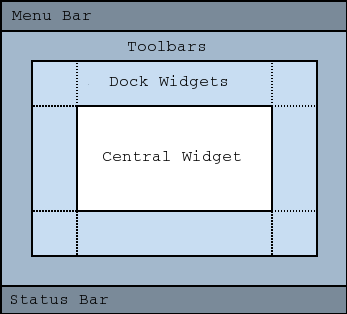
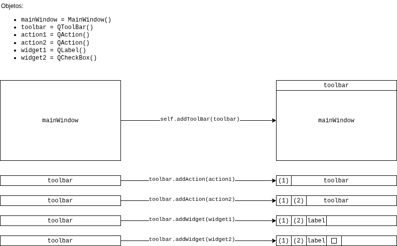
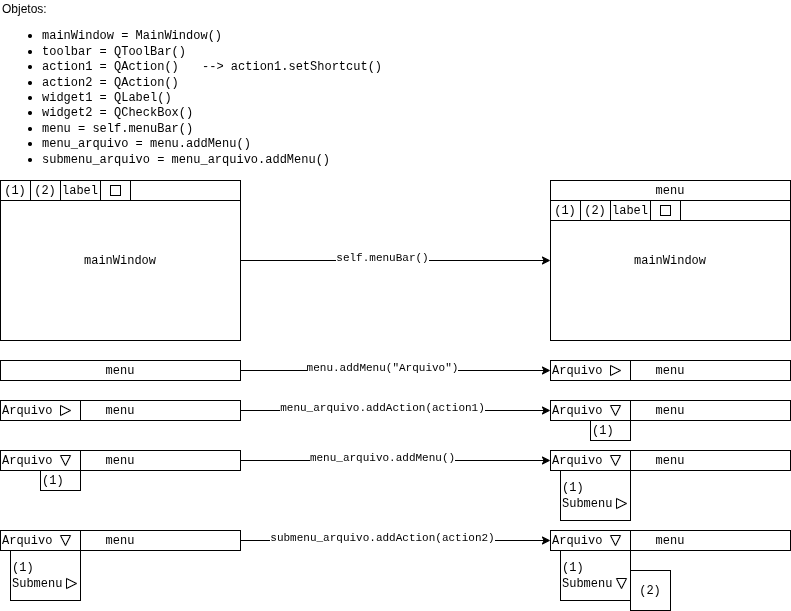

# Aula 03

**Sumário**

- [Aula 03](#aula-03)
  - [Barra de ferramentas (Toolbar)](#barra-de-ferramentas-toolbar)
  - [Menus](#menus)
  - [Exercícios](#exercícios)
    - [Barra de Ferramenta](#barra-de-ferramenta)
      - [Fácil](#fácil)
      - [Médio](#médio)
      - [Difícil](#difícil)
    - [Barra de Menu](#barra-de-menu)
      - [Fácil](#fácil-1)
      - [Médio](#médio-1)
      - [Difícil](#difícil-1)
    - [Todos os tópicos vistos até então](#todos-os-tópicos-vistos-até-então)
      - [Fácil](#fácil-2)
      - [Médio](#médio-2)
      - [Difícil](#difícil-2)


## Barra de ferramentas (Toolbar)

A barra de ferramentas é um dos elementos mais comuns em interfaces. Ela consiste em uma barra que contém ícones e/ou texto para realizar tarefas, as quais podem ser difíceis de se encontrar pelos menus.

No Qt as barras de ferramenta são criadas a partir da classe [`QToolBar`](https://doc.qt.io/qtforpython-6/PySide6/QtWidgets/QToolBar.html#PySide6.QtWidgets.QToolBar). Após instanciar a classe, ela pode ser integrada à `QMainWindow` a partir de seu método [`addToolbar`](https://doc.qt.io/qtforpython-6/PySide6/QtWidgets/QMainWindow.html#PySide6.QtWidgets.QMainWindow.addToolBar).

<figure style="text-align:center;">
    
    <figcaption>Esquema da QMainWindow</figcaption>
</figure>

[Exemplo](exemplos/exemplo01.py):

```python
from PySide6.QtCore import Qt
from PySide6.QtWidgets import QApplication, QLabel, QMainWindow, QToolBar

class MainWindow(QMainWindow):
    def __init__(self):
        super().__init__()
        self.setWindowTitle("Barra de Ferramentas")
        
        label = QLabel("Olá!")
        # O namespace `Qt` tem muitos atributos para customizar widgets. 
        # Veja: http://doc.qt.io/qt-6/qt.html
        label.setAlignment(Qt.AlignmentFlag.AlignCenter)

        self.setCentralWidget(label)

        toolbar = QToolBar("Nome da barra de ferramentas")
        self.addToolBar(toolbar)
        
        

app = QApplication(sys.argv)

window = MainWindow()
window.show()

app.exec()
```

Adicionar um ou mais `QButton` à barra de ferramentas parece ser o próximo passo natural. Porém o Qt possui uma classe melhor para esse caso: [`QAction`](https://doc.qt.io/qtforpython-6/PySide6/QtGui/QAction.html#PySide6.QtGui.QAction). Essa classe fornece uma forma de descrever interfaces **abstratas**. Isso quer dizer que é possível definir múltiplas interfaces a partir de um único objeto.

Por exemplo, é comum existirem ações que são representadas na barra de ferramentas, e também no menu. Imagine a função "cortar", presente no menu via `Editar -> Cortar`, e também na barra de ferramentas com o ícone de uma tesoura, e também através do atalho de teclado `Ctrl+X`.

Sem o `QAction` essa ação de cortar teria de ser definida em vários locais. Com o `QAction` essa ação pode ser definida **apenas uma vez** e adicionada tanto ao menu quanto à barra de ferramentas. Cada `QAction` possui nome, mensagens de status, ícones e sinais que podem ser conectados a `slots`, e outras coisas mais.

[Exemplo](exemplos/exemplo02.py), com ícones baixados do site [p.yusukekamiyamane](https://p.yusukekamiyamane.com/):

```python
import sys
from PySide6.QtCore import QSize, Qt
from PySide6.QtGui import QAction, QIcon
from PySide6.QtWidgets import QApplication, QCheckBox, QLabel, QMainWindow, QStatusBar, QToolBar

class MainWindow(QMainWindow):
    def __init__(self):
        super().__init__()
        self.setWindowTitle("Barra de Ferramentas")
        
        label = QLabel("Um texto qualquer")
        # O namespace `Qt` tem muitos atributos para customizar widgets. 
        # Veja: http://doc.qt.io/qt-6/qt.html
        label.setAlignment(Qt.AlignmentFlag.AlignCenter)

        self.setCentralWidget(label)

        toolbar = QToolBar("Barra de ferramentas principal")
        toolbar.setIconSize(QSize(16, 16))
        self.addToolBar(toolbar)
        
        botao_action = QAction(QIcon("AULAS/03/imagens/icons/bug.png"), "Botão", self)
        botao_action.setCheckable(True)
        botao_action.setStatusTip("O meu botão")
        botao_action.triggered.connect(self.toolbar_button_clicked)
        toolbar.addAction(botao_action)
        
        toolbar.addSeparator()
        
        botao_action2 = QAction(QIcon("AULAS/03/imagens/icons/android.png"), "Botão 2", self)
        botao_action2.setStatusTip("Meu outro botão")
        botao_action2.triggered.connect(self.toolbar_button_clicked)
        botao_action2.setCheckable(True)
        toolbar.addAction(botao_action2)

        toolbar.addSeparator()
        
        toolbar.addWidget(QLabel("Olares"))
        toolbar.addSeparator()
        toolbar.addWidget(QCheckBox())
        
        # Barra de status - para mostrar o nome dos botões
        self.setStatusBar(QStatusBar(self))
        
    def toolbar_button_clicked(self, s):
        print(s)
        

app = QApplication(sys.argv)

window = MainWindow()
window.show()

app.exec()
```

<figure style="text-align:center;">
    
    <figcaption>Esquema Geral - Barra de Ferramentas</figcaption>
</figure>

## Menus

Os menus podem ser aninhados para criar uma **árvore hierárquica** de funções, e frequentemente oferecem suporte para atalhos de teclado.

Para criar uma barra de menu basta chamar o método `menuBar()` do `QMainWindow`, ou instanciar [`QMenuBar`](https://doc.qt.io/qtforpython-6/PySide6/QtWidgets/QMenuBar.html#PySide6.QtWidgets.QMenuBar) e adicioná-lo como widget. Para adicionar um menu à barra é precisa chamar o método [`addMenu()`](https://doc.qt.io/qtforpython-6/PySide6/QtWidgets/QMenuBar.html#PySide6.QtWidgets.QMenuBar.addMenu). E para adicionar submenus, basta chamar o mesmo método.

A seguir um exemplo completo mostrando uma aplicação com menu (incluindo atalho de teclado), submenu e barra de ferramenta:

```python
import sys
from PySide6.QtCore import QSize, Qt
from PySide6.QtGui import QAction, QIcon, QKeySequence
from PySide6.QtWidgets import QApplication,QCheckBox, QLabel, QMainWindow, QStatusBar, QToolBar

class MainWindow(QMainWindow):
    def __init__(self):
        super().__init__()
        self.setWindowTitle("MENUDOS")

        label = QLabel("Um texto qualquer")

        # O namespace `Qt` tem muitos atributos para customizar widgets. 
        # Veja: http://doc.qt.io/qt-6/qt.html
        label.setAlignment(Qt.AlignmentFlag.AlignCenter)

        # Configurando o widcet central da janela. O widget vai expandir para ocupar todo o espaço da janela por padrão.
        self.setCentralWidget(label)

        toolbar = QToolBar("Barra de Ferramentas Principal")
        toolbar.setIconSize(QSize(16, 16))
        self.addToolBar(toolbar)

        button_action = QAction(QIcon("AULAS/03/imagens/icons/bug.png"), "Botão1", self)
        button_action.setStatusTip("Um botão")
        button_action.triggered.connect(self.toolbar_button_clicked)
        button_action.setCheckable(True)
        # É possível usar atalhos de teclado usando nomes de teclas (e.g. Ctrl+p), 
        # identificadores do namespace Qt (e.g. Qt.CTRL + Qt.Key_P) 
        # ou identificadores agnósticos de sistema (e.g. QKeySequence.Print)
        button_action.setShortcut(QKeySequence("Ctrl+p"))
        toolbar.addAction(button_action)

        toolbar.addSeparator()

        button_action2 = QAction(QIcon("AULAS/03/imagens/icons/android.png"), "Botão2", self)
        button_action2.setStatusTip("Outro botão")
        button_action2.triggered.connect(self.toolbar_button_clicked)
        button_action2.setCheckable(True)
        toolbar.addAction(button_action2)

        toolbar.addWidget(QLabel("Olares"))
        toolbar.addWidget(QCheckBox())

        self.setStatusBar(QStatusBar(self))

        menu = self.menuBar()

        menu_arquivo = menu.addMenu("Arquivo")
        menu_arquivo.addAction(button_action)

        menu_arquivo.addSeparator()

        submenu_arquivo = menu_arquivo.addMenu("Submenu")

        submenu_arquivo.addAction(button_action2)

    def toolbar_button_clicked(self, s):
        print(s)


app = QApplication(sys.argv)

window = MainWindow()
window.show()
app.exec()
```

<figure style="text-align:center;">
    
    <figcaption>Esquema Geral - Barra de Menus</figcaption>
</figure>

## Exercícios

### Barra de Ferramenta

#### Fácil

1. Adicione uma QToolBar a uma QMainWindow e insira um QAction com texto "Abrir".
2. Crie um QAction com ícone (usando QIcon.fromTheme) e adicione à QToolBar.
3. Configure uma QToolBar com QAction "Salvar" e conecte ao slot que imprime "Salvo".
4. Adicione dois QAction (Novo e Fechar) em uma QToolBar horizontal.
5. Use QAction com shortcut="Ctrl+N" na QToolBar.
6. Crie uma QToolBar e defina iconSize=QSize(32, 32).
7. Adicione um QAction separador (addSeparator) em uma QToolBar.
8. Configure QToolBar com QAction toggleable (checkable=True).
9. Use QAction "Copiar" na QToolBar e conecte a um slot simples.
10. Adicione uma QToolBar flutuante (setFloatable=True).
11. Crie QAction com tooltip="Abrir arquivo" na QToolBar.
12. Use QToolBar com três QAction e defina movable=False.
13. Adicione QAction "Imprimir" com ícone padrão à QToolBar.
14. Configure QToolBar com QAction que muda texto ao ser clicado.
15. Crie uma QToolBar vazia e adicione um QAction via addAction.

#### Médio

1. Crie múltiplas QToolBar em uma QMainWindow (superior, lateral) com QAction compartilhados.
2. Use QAction com menu pop-up (setMenu) em uma QToolBar.
3. Implemente QToolBar com QAction que atualiza statusBar via sinal.
4. Adicione QAction dinâmicos a uma QToolBar em tempo de execução.
5. Crie QToolBar com QAction checkable que alterna visibilidade de um widget.
6. Use QToolBar com QAction e QSpinBox como widget (addWidget).
7. Configure QAction com ícone personalizado e shortcut em QToolBar.
8. Implemente QToolBar que salva estado (posições) com QSettings.
9. Crie QAction agrupados em QToolBar usando QActionGroup.
10. Use QToolBar com QAction que dispara evento customizado.

#### Difícil

1. Desenvolva uma QToolBar customizada com drag-and-drop de QAction entre múltiplas toolbars.
2. Crie um sistema de QToolBar com ações registradas dinamicamente via plugin e sinais.
3. Implemente QToolBar com QAction que executa ações em QThread e atualiza progresso.
4. Desenvolva QToolBar responsiva que muda orientação em resizeEvent e reorganiza QAction.
5. Crie um editor de toolbar onde QAction podem ser adicionados/removidos via menu contextual e persistidos.

### Barra de Menu

#### Fácil

1. Crie um QMenuBar em QMainWindow e adicione menu "Arquivo" com QAction "Novo".
2. Adicione QAction "Abrir" ao menu "Arquivo" via menuBar().
3. Configure menu "Editar" com QAction "Copiar" e shortcut Ctrl+C.
4. Use addSeparator() em um QMenu "Ajuda".
5. Crie QAction "Sair" no menu "Arquivo" que fecha a janela.
6. Adicione submenu "Exportar" dentro de menu "Arquivo".
7. Configure QMenuBar com QAction "Sobre" que mostra QMessageBox.
8. Use QAction com ícone no menu "Editar".
9. Crie menu "Ver" com QAction checkable "Modo Escuro".
10. Adicione QAction "Imprimir" ao menu "Arquivo".
11. Configure menu "Ferramentas" vazio e adicione QAction via addAction.
12. Use QMenuBar com QAction que imprime mensagem no slot.
13. Crie submenu "Recente" com três QAction dinâmicos.
14. Adicione QAction "Desfazer" com shortcut no menu "Editar".
15. Configure menu "Janela" com QAction "Minimizar".

#### Médio

1. Crie QMenuBar com menus aninhados e QAction compartilhados com QToolBar.
2. Implemente QAction com QMenu pop-up dinâmico no menuBar.
3. Use QMenuBar com QAction que atualiza widgets via sinais.
4. Crie menu contextual (contextMenu) sincronizado com menuBar.
5. Configure QAction em QMenuBar com ícones e tooltips avançados.
6. Implemente menu "Arquivo" que carrega arquivos recentes via QSettings.
7. Use QActionGroup para menus de rádio no menuBar.
8. Crie QMenuBar com ações que disparam eventos de mouse personalizados.
9. Adicione QMenu dinâmico que se atualiza em runtime.
10. Configure menuBar com QAction que valida estado antes de executar.

#### Difícil

1. Desenvolva um QMenuBar extensível com QAction carregados de JSON e sinais de atualização.
2. Crie sistema de menu com undo/redo stack integrado via QAction e eventos.
3. Implemente QMenuBar com suporte a temas (QAction ícones mudam dinamicamente).
4. Desenvolva menuBar com ações assíncronas (QThread) e barra de progresso.
5. Crie um editor de menus onde QAction podem ser reorganizados via drag-and-drop e salvos.

### Todos os tópicos vistos até então

#### Fácil

1. Crie QMainWindow com QVBoxLayout, QToolBar (Ação "Salvar"), menuBar ("Arquivo" > "Novo") e conecte QAction ao slot que atualiza QLabel via sinal clicked.
2. Use QHBoxLayout central, QToolBar com QAction "Abrir", menu "Editar" e slot que captura keyPressEvent para atualizar QLineEdit.
3. Configure QGridLayout, QToolBar com QAction toggleable, menu "Ver" e sinal stateChanged que mostra/esconde widget via slot.
4. Adicione QStackedLayout com páginas, QToolBar "Próxima", menu "Navegação" e slot que troca página via sinal currentChanged.
5. Crie QVBoxLayout com QTableWidget, QToolBar "Adicionar", menu "Arquivo" e evento mousePress que emite sinal para slot de inserção.
6. Use QHBoxLayout, QToolBar com QAction "Copiar", menu "Editar" e slot conectado a textChanged de QTextEdit.
7. Configure QGridLayout, QToolBar "Zoom", menu "Ver" e sinal valueChanged de QSlider que atualiza QLabel via slot.
8. Crie QMainWindow com QVBoxLayout, QToolBar "Imprimir", menu "Arquivo" e slot que reage a closeEvent.
9. Adicione QStackedLayout, QToolBar com QAction "Página 1", menu "Navegação" e evento resizeEvent que ajusta layout.
10. Use QHBoxLayout com QPushButton, QToolBar "Limpar", menu "Editar" e sinal clicked que aciona slot para limpar QLineEdit.

#### Médio

1. Desenvolva QMainWindow com QGridLayout aninhado, QToolBar com QAction dinâmicos, menuBar com submenus, sinais para sincronizar QTableWidget e evento dragEnterEvent.
2. Crie formulário com QVBoxLayout principal, QToolBar "Validar", menu "Arquivo" > "Salvar", sinais de validação e slots que capturam focusOutEvent em QLineEdit.
3. Use QStackedLayout com múltiplas páginas, QToolBar compartilhada com QAction, menu "Ver" e slots que reagem a wheelEvent para zoom em QGraphicsView.
4. Implemente dashboard com QHBoxLayout, QToolBar com QAction checkable, menu "Ferramentas" e sinais para atualizar QProgressBar via evento paintEvent.
5. Crie QMainWindow com QGridLayout, QToolBar "Undo", menu "Editar" com QActionGroup, sinais para QUndoStack e slots integrados a keyPressEvent.
6. Configure QVBoxLayout + QSplitter, QToolBar flutuante, menuBar com ações recentes e slots que usam dropEvent em QTextEdit.
7. Desenvolva app com QStackedLayout, QToolBar customizada, menu "Janela" e sinais para sincronizar múltiplos widgets via resizeEvent.

#### Difícil

1. Crie um editor completo: QMainWindow com QVBoxLayout principal + QGridLayout interno, QToolBar com ações arrastáveis, menuBar extensível via JSON, sinais para undo/redo, slots assíncronos, eventos de mouse multitoque em QGraphicsScene e widgets personalizados.
2. Desenvolva dashboard dinâmico: QHBoxLayout + QStackedLayout, QToolBar com plugins, menuBar com ações carregadas em runtime, sinais em tempo real para QTableView, slots para processamento em QThread, eventos drag-and-drop e resize responsivo.
3. Implemente aplicação de desenho: QGridLayout central, QToolBar com ferramentas, menu "Arquivo" com exportação, sinais customizados para mudanças de estado, slots para salvamento, eventos de pintura e gestos, integrando QGraphicsView e múltiplos widgets interativos.