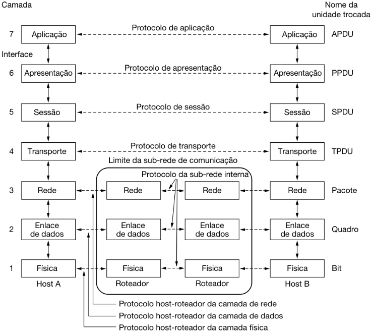

# Aula 07

Sumário

- [Aula 07](#aula-07)
  - [Comunicação entre processos](#comunicação-entre-processos)
  - [Módulo `socket`](#módulo-socket)
    - [Exemplo](#exemplo)


## Comunicação entre processos

Vamos revisitar brevemente alguns conceitos de Redes de Computadores.

<div style="text-align: center;">
    
</div>

Em todas as camadas (Enlace -> Aplicação) temos protocolos que precisam de algum metadado de endereço.

<div style="text-align: center;">
    
</div>

Suponha que você esteja com 2 navegadores abertos. No primeiro navegador você tenta acessar o YouTube, e no segundo navegador você tenta acessar a Twitch. Na **rede**, o seu computador tem um **endereço IP** único; em um **enlace local**, a sua placa de rede tem um **endereço MAC** único.

<details>
    <summary>Mas qual é o endereço dos programas? Como garantir que o YouTube vai ser entregue para o primeiro navegador, e o site da Twitch para o segundo?</summary>
    <p style="padding:5px 0px 0px 20px;"><strong>PORTAS!</strong></p>
    <p style="padding:0px 0px 0px 20px;">Uma porta é um valor mapeado em 16 bits, ou seja, valores que variam de <strong>0</strong> a <strong>65535</strong>.</p>
    <p style="padding:0px 0px 0px 20px;">A <strong>IANA</strong> (<i>International Assigned Number Authority</i>) é a organização responsável pelas portas (<a href="https://datatracker.ietf.org/doc/rfc6335/">RFC 6335</a>):</p>
    <ul>
        <li><strong>Portas de Sistema</strong> (<i>System Ports</i>), também chamadas de <strong>Portas bem conhecidas</strong> (<i>Well Known Ports</i>): 0 - 1023.</li>
        <li><strong>Portas de Usuário</strong> (<i>User Ports</i>), também chamadas de <strong>Portas Registradas</strong> (<i>Registered Ports</i>): 1024 - 49151.</li>
        <li><strong>Portas Dinâmicas</strong> (<i>Dynamic Ports</i>), também chamadas de <strong>Portas Privadas</strong> ou <strong>Efêmeras</strong> (<i>Private</i> ou <i>Ephemeral Ports</i>), nunca assinaladas: 49152 - 65535.</li>
    </ul>
    <p style="padding:0px 0px 0px 20px;">As portas assinaláveis (0 - 49151) estão em um dos três estados:</p>
    <ul>
        <li><strong>Assinaladas</strong>: números de porta atualmente assinaladas ao serviço indicado no registro.</li>
        <li><strong>Não assinaladas</strong>: números de porta não assinaladas atualmente estão disponı́veis para assinalamento, sob requisição.</li>
        <li><strong>Reservadas</strong>: números de porta reservadas não estão disponı́veis para assinalamento regular. Essas portas foram reservadas para propósitos especiais.</li>
    </ul>
    <p style="padding:0px 0px 0px 20px;"><a href="https://www.iana.org/assignments/service-names-port-numbers/service-names-port-numbers.xhtml">Lista das portas.</a></p>
</details>

<br>

Outro conceito que é importante lembrar é que cada camada fornece serviços para a camada acima, e esse serviço é entregue a partir de uma interface.

<div style="text-align: center;">
    
</div>

A interface entre a **Camada de Aplicação** e a **Camada de Transporte** é chamada de **socket** e consiste em um endereço IP e um número de porta.

<div style="text-align: center;">
    
</div>

## Módulo [`socket`](https://docs.python.org/3.14/library/socket.html#module-socket)

O módulo [`socket`](https://docs.python.org/3.14/library/socket.html#module-socket) do `Python` fornece uma interface de baixo-nível para comunicação em redes.

A criação de um objeto `socket` pode ser feito da seguinte forma:

```python
import socket

s = socket.socket(family=AF_INET, type=SOCK_STREAM, proto=0, fileno=None)
```

- Para mais informações sobre o parâmetro `family`, [clique aqui](https://docs.python.org/3.14/library/socket.html#socket-families). Os dois principais são `AF_INET` para IPv4 e `AF_INET6` para IPv6.
- Os dois valores principais para `type` são `SOCK_STREAM`, que define o uso do protocolo de transporte TCP, e `SOCK_DGRAM` para o protocolo UDP.
- Os outros dois parâmetros podem ser deixados com seus valores padrões. Só serão modificados em casos bastante específicos.

Documentação de outras funções de [criação de socket](https://docs.python.org/3.14/library/socket.html#creating-sockets) e de [outros serviços](https://docs.python.org/3.14/library/socket.html#other-functions).

Principais métodos de um objeto `socket`:

- ***Server-side***
  - `bind(address)`: associa o `socket` com um `address`, uma tupla (*host*, *port*).
  - `listen([backlog])`: coloca o `socket` do servidor em modo de escuta, à espera de conexões de clientes. O `backlog` é opcional e define o tamanho de uma fila de conexões a serem aceitas.
  - `accept()`: aceita uma conexão de um cliente, retornando um novo objeto `socket` representando a conexão do cliente e seu endereço.
- ***Client-side***
  - `connect(address)`: estabelece uma conexão com um servidor remoto especificado em `address`, uma tupla (*host*, *port*).
- **Transferência de dados**
  - `send(data)`: envia dados pelo `socket`. Os dados precisam ser codificados em bytes antes do envio, por exemplo, `data.encode('utf-8'))`.
  - `recv(buffer_size)`: recebe dados do `socket`. Retorna um objeto de bytes, o qual pode precisar ser decodificado para uma string, por exemplo, `data.decode('utf-8'))`
- **Gerenciamento de conexão**
  - `close()`: encerra a conexão do `socket`.

### Exemplo

**SERVIDOR**

```python
import socket

HOST = '127.0.0.1'  # Standard loopback interface address (localhost)
PORT = 65432        # Port to listen on (non-privileged ports are > 1023)

with socket.socket(socket.AF_INET, socket.SOCK_STREAM) as s:
    s.bind((HOST, PORT))
    s.listen()
    conn, addr = s.accept()
    with conn:
        print(f"Connected by {addr}")
        while True:
            data = conn.recv(1024)
            if not data:
                break
            conn.sendall(data)
```

**CLIENTE**

```python
import socket

HOST = '127.0.0.1'  # The server's hostname or IP address
PORT = 65432        # The port used by the server

with socket.socket(socket.AF_INET, socket.SOCK_STREAM) as s:
    s.connect((HOST, PORT))
    s.sendall(b"Hello, world")
    data = s.recv(1024)

print(f"Received {data.decode('utf-8')}")
```


TODO: estudar os materiais a seguir
    - https://realpython.com/python-sockets/
    - https://medium.com/@urapython.community/introdu%C3%A7%C3%A3o-a-sockets-em-python-44d3d55c60d0
    - https://docs.python.org/3/howto/sockets.html / https://docs.python.org/pt-br/3/howto/sockets.html