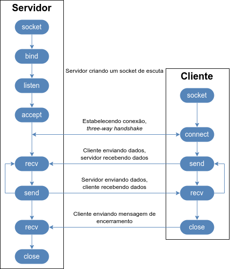

# Aula 07

Sumário

- [Aula 07](#aula-07)
  - [Comunicação entre processos](#comunicação-entre-processos)
  - [Módulo `socket`](#módulo-socket)
    - [Socket TCP](#socket-tcp)
  - [Alternativas](#alternativas)


## Comunicação entre processos

Vamos revisitar brevemente alguns conceitos de Redes de Computadores.

<div style="text-align: center;">
    
</div>

Em todas as camadas (Enlace -> Aplicação) temos protocolos que precisam de algum metadado de endereço.

<div style="text-align: center;">
    
</div>

Suponha que você esteja com 2 navegadores abertos. No primeiro navegador você tenta acessar o YouTube, e no segundo navegador você tenta acessar a Twitch. Na **rede**, o seu computador tem um **endereço IP** único; em um **enlace local**, a sua placa de rede tem um **endereço MAC** único.

<details>
    <summary>Mas qual é o endereço dos programas? Como garantir que o YouTube vai ser entregue para o primeiro navegador, e o site da Twitch para o segundo?</summary>
    <p style="padding:5px 0px 0px 20px;"><strong>PORTAS!</strong></p>
    <p style="padding:0px 0px 0px 20px;">Uma porta é um valor mapeado em 16 bits, ou seja, valores que variam de <strong>0</strong> a <strong>65535</strong>.</p>
    <p style="padding:0px 0px 0px 20px;">A <strong>IANA</strong> (<i>International Assigned Number Authority</i>) é a organização responsável pelas portas (<a href="https://datatracker.ietf.org/doc/rfc6335/">RFC 6335</a>):</p>
    <ul>
        <li><strong>Portas de Sistema</strong> (<i>System Ports</i>), também chamadas de <strong>Portas bem conhecidas</strong> (<i>Well Known Ports</i>): 0 - 1023.</li>
        <li><strong>Portas de Usuário</strong> (<i>User Ports</i>), também chamadas de <strong>Portas Registradas</strong> (<i>Registered Ports</i>): 1024 - 49151.</li>
        <li><strong>Portas Dinâmicas</strong> (<i>Dynamic Ports</i>), também chamadas de <strong>Portas Privadas</strong> ou <strong>Efêmeras</strong> (<i>Private</i> ou <i>Ephemeral Ports</i>), nunca assinaladas: 49152 - 65535.</li>
    </ul>
    <p style="padding:0px 0px 0px 20px;">As portas assinaláveis (0 - 49151) estão em um dos três estados:</p>
    <ul>
        <li><strong>Assinaladas</strong>: números de porta atualmente assinaladas ao serviço indicado no registro.</li>
        <li><strong>Não assinaladas</strong>: números de porta não assinaladas atualmente estão disponı́veis para assinalamento, sob requisição.</li>
        <li><strong>Reservadas</strong>: números de porta reservadas não estão disponı́veis para assinalamento regular. Essas portas foram reservadas para propósitos especiais.</li>
    </ul>
    <p style="padding:0px 0px 0px 20px;"><a href="https://www.iana.org/assignments/service-names-port-numbers/service-names-port-numbers.xhtml">Lista das portas.</a></p>
</details>

<br>

Outro conceito que é importante lembrar é que cada camada fornece serviços para a camada acima, e esse serviço é entregue a partir de uma interface.

<div style="text-align: center;">
    
</div>

A interface entre a **Camada de Aplicação** e a **Camada de Transporte** é chamada de **socket** e consiste em um endereço IP e um número de porta.

<div style="text-align: center;">
    
</div>

## Módulo [`socket`](https://docs.python.org/3.14/library/socket.html#module-socket)

O módulo [`socket`](https://docs.python.org/3.14/library/socket.html#module-socket) do `Python` fornece uma interface de baixo-nível para comunicação em redes.

A função principal, usada para criar um objeto `socket`, é:

```python
socket(family=AF_INET, type=SOCK_STREAM, proto=0, fileno=None)
```

- Os dois principais valores para `family` são `AF_INET` para IPv4 e `AF_INET6` para IPv6.
- Os dois valores principais para `type` são `SOCK_STREAM`, que define o uso do protocolo de transporte TCP, e `SOCK_DGRAM` para o protocolo UDP.
- Os outros dois parâmetros podem ser deixados com seus valores padrões. Só serão modificados em casos bastante específicos.

Os métodos principais de um objeto `socket` são:

- `bind(address)`: associa o `socket` com um `address`, uma tupla (*host*, *port*), ou seja, um nome de host ou endereço IP, e número de porta.
- `listen([backlog])`: coloca o `socket` do servidor em modo de escuta, à espera de conexões de clientes. O `backlog` é opcional e define o tamanho de uma fila de conexões a serem aceitas.
- `accept()`: aceita uma conexão de um cliente, retornando um novo objeto `socket` representando a conexão do cliente e seu endereço.
- `connect(address)`: estabelece uma conexão com um servidor remoto especificado em `address`, uma tupla (*host*, *port*).
- `connect_ex(address)`: similar ao `connect()`, porém retorna um indicador de erro em vez de lançar uma exceção para erros retornados pela chamada do método `connect()` no nível da linguagem `C`. É útil para conexões assíncronas.
- `send(data)`: envia dados pelo `socket`. Os dados precisam ser codificados em bytes antes do envio, por exemplo, `data.encode('utf-8'))`.
- `recv(buffer_size)`: recebe dados do `socket`. Retorna um objeto de bytes, o qual pode precisar ser decodificado para uma string, por exemplo, `data.decode('utf-8'))`
- `close()`: encerra a conexão do `socket`.

### Socket TCP

O **TCP** (*Transmition Control Protocol*), também referido como **Padrão 7** (*Standard*/*STD* 7) da Internet é definido nos seguintes RFCs: [761](https://datatracker.ietf.org/doc/rfc761/) $\rightarrow$ [793](https://datatracker.ietf.org/doc/rfc793/) $\rightarrow$ [9293](https://datatracker.ietf.org/doc/rfc9293/).

É orientado a conexão (ponto a ponto), confiável (garante que o segmento será entregue) e com entrega ordenada. Provê serviço ***full-duplex***, ou seja, os dados de remetente e destinatário podem fluir ao mesmo tempo.

A imagem a seguir mostra o fluxo de chamadas e dados de um `socket` TCP:

<figure style="text-align: center;">
    
    <figcaption>Fluxo do socket TCP (<a href="https://realpython.com/python-sockets/">Fonte da imagem</a>)</fifcaption>
</figure>

Exemplo: [echo-server](exemplo/echo-server.py) e [echo-client](exemplo/echo-client.py).

Mais sobre `socket` com Python:

- [Real Python - Socket Programming in Python (Guide)](https://realpython.com/python-sockets/).
- [Introdução a Sockets em Python](https://medium.com/@urapython.community/introdu%C3%A7%C3%A3o-a-sockets-em-python-44d3d55c60d0).
- Documentação do módulo: [EN](https://docs.python.org/3.14/library/socket.html) | [PT-BR](https://docs.python.org/pt-br/3.14/library/socket.html#socket-objects).
- Documentação [Socket Programming HOWTO](https://docs.python.org/3/howto/sockets.html) / [Programação de Soquetes](https://docs.python.org/pt-br/3/howto/sockets.html).

## Alternativas

O exemplo visto serviu para mostrar, de forma simples, como fazer com uma conexão com um servidor via TCP. Contudo, não há necessidade de se debruçar sobre muitos detalhes dessa parte, a não ser que você esteja bastante curioso, ou precise ter controle dos detalhes em alguma aplicação que esteja sendo criada. Ou seja, isso será necessário em aplicações bastante nichadas.

O mais comum em desenvolvimento que necessite de comunicação com algum servidor é utilizar algum `Web Framework`. Os três mais famosos do Python são:

- [`Flask`](https://flask.palletsprojects.com/en/stable/): consiste em um `Micro Web Framework` porque é muito básico. Por exemplo, ele não possui camada de abstração para banco de dados, validação de formulário, etc. Muitos componentes e recursos podem ser adicionados com o uso de bibliotecas de terceiros ou extensões, bibliotecas que funcionam como se tivessem sido implementadas no próprio `Flask`.
- [`FastAPI`](https://fastapi.tiangolo.com/): consiste em um `Web Framework` moderno e rápido (alto-desempenho) para o desenvolvimento de APIs com Python. Suas principais características são:
  - **Velocidade**: desempenho muito alto, em pé de igualdade com `NodeJS` e `Go`.
  - **Rápido para programar**: aumenta a velocidade de desenvolvimento entre 200% a 300%.
  - **Menos bugs**: reduz em cerca de 40% erros causados por humanos.
  - **Intuitivo**: excelente suporte do editor; *completion* a rodo e menos tempo debugando.
  - **Fácil**: projetado para ser fácil de usar e aprender, resultando em menos tempo lendo a documentação.
  - **Curto**: minimiza duplicação de código, a partir de múltiplas funcionalidades de cada declaração de parâmetro, resultando em menos bugs.
  - **Robusto**: retorna código pronto para produção, com documentação interativa automática.
  - **Baseado em padrões**: baseado em (e totalmente compatível com) padrões abertos para APIs, como [OpenAPI](https://github.com/OAI/OpenAPI-Specification) e [JSON Schema](https://json-schema.org/).
- [`Django`](https://www.djangoproject.com/): consiste em um `Web Framework` de alto nível que incentiva desenvolvimento rápido e design limpo e pragmático. Suas principais características são:
  - **Ridiculamente rápido**: foi projetado para auxiliar aos desenvolvedores partirem da conceituação para uma aplicação completa, o mais rápido possível.
  - **Completo**: inclui dezenas de recursos extras para lidar com tarefas de desenvolvimento web comuns. O Django cuida da autenticação de usuário, administração de conteúdo, mapa do site, feed RSS, e vários outros, no ponto de usar.
  - **Tranquilizadoramente seguro**: leva a segurança a sério e ajuda os desenvolvedores a evitar muitos erros comuns de segurança, como `SQL Injection`, `Cross-Site Scripting`, `Cross-Site Request Forgery` e `Clickjacking`. Seu sistema de autenticação de usuário fornece um meio seguro de gerenciar contas e senhas.
  - **Extremamente escalável**: alguns dos sites mais movimentados do mundo utilizam a capacidade do Django de escalar de forma rápida e flexível para atender às demanas de tráfego mais intensas.
  - **Incrivelmente versátil**: Empresas, organizações e governos têm usado o Django para desenvolver tudo quanto é de aplicação, de sistemas de gerenciamento de conteúdo a redes sociais e plataformas de computação científica.
  - De acordo com a [Wikipedia](https://en.wikipedia.org/wiki/Django_(web_framework)): *o objetivo principal do Djano é facilitar a criação de sites complexos e orientados a banco de dados*.