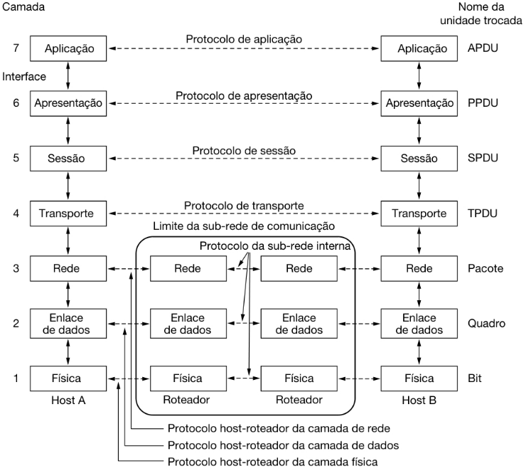
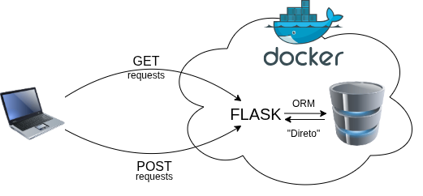

# Aula 08

## Comunicação entre processos

Vamos revisitar brevemente alguns conceitos de Redes de Computadores.

    

Em todas as camadas (Enlace --> Aplicação) temos protocolos que precisam de algum metadado de endereço.

    

Suponha que você esteja com 2 navegadores abertos. No primeiro navegador você tenta acessar o YouTube, e no segundo navegador você tenta acessar a Twitch. Na **rede**, o seu computador tem um **endereço IP** único; em um **enlace local**, a sua placa de rede tem um **endereço MAC** único.

    
Mas qual é o endereço dos programas? Como garantir que o YouTube vai ser entregue para o primeiro navegador, e o site da Twitch para o segundo?

    
<strong>PORTAS!</strong>

    
Uma porta é um valor mapeado em 16 bits, ou seja, valores que variam de <strong>0</strong> a <strong>65535</strong>.

    
A <strong>IANA</strong> (<i>International Assigned Number Authority</i>) é a organização responsável pelas portas (<a href="https://datatracker.ietf.org/doc/rfc6335/">RFC 6335</a>):

    <ul>
        <li><strong>Portas de Sistema</strong> (<i>System Ports</i>), também chamadas de <strong>Portas bem conhecidas</strong> (<i>Well Known Ports</i>): 0 - 1023.</li>
        <li><strong>Portas de Usuário</strong> (<i>User Ports</i>), também chamadas de <strong>Portas Registradas</strong> (<i>Registered Ports</i>): 1024 - 49151.</li>
        <li><strong>Portas Dinâmicas</strong> (<i>Dynamic Ports</i>), também chamadas de <strong>Portas Privadas</strong> ou <strong>Efêmeras</strong> (<i>Private</i> ou <i>Ephemeral Ports</i>), nunca assinaladas: 49152 - 65535.</li>
    </ul>
    
As portas assinaláveis (0 - 49151) estão em um dos três estados:

    <ul>
        <li><strong>Assinaladas</strong>: números de porta atualmente assinaladas ao serviço indicado no registro.</li>
        <li><strong>Não assinaladas</strong>: números de porta não assinaladas atualmente estão disponı́veis para assinalamento, sob requisição.</li>
        <li><strong>Reservadas</strong>: números de porta reservadas não estão disponı́veis para assinalamento regular. Essas portas foram reservadas para propósitos especiais.</li>
    </ul>
    
<a href="https://www.iana.org/assignments/service-names-port-numbers/service-names-port-numbers.xhtml">Lista das portas.</a>

 

Outro conceito que é importante lembrar é que cada camada fornece serviços para a camada acima, e esse serviço é entregue a partir de uma interface.

    

A interface entre a **Camada de Aplicação** e a **Camada de Transporte** é chamada de **socket** e consiste em um endereço IP e um número de porta.

    

## Como se comunicar pela rede usando o Python

O mais comum em desenvolvimento que necessite de comunicação com algum servidor é utilizar algum `Web Framework`. Os três mais famosos do Python são:

- [`Flask`](https://flask.palletsprojects.com/en/stable/): consiste em um `Micro Web Framework` porque é muito básico. Por exemplo, ele não possui camada de abstração para banco de dados, validação de formulário, etc. Muitos componentes e recursos podem ser adicionados com o uso de bibliotecas de terceiros ou extensões, bibliotecas que funcionam como se tivessem sido implementadas no próprio `Flask`.
- [`FastAPI`](https://fastapi.tiangolo.com/): consiste em um `Web Framework` moderno e rápido (alto-desempenho) para o desenvolvimento de APIs com Python.
- [`Django`](https://www.djangoproject.com/): consiste em um `Web Framework` de alto nível que incentiva desenvolvimento rápido e design limpo e pragmático.

Tanto o `FastAPI` quanto o `Django` permitem a criação do *back-end* de uma aplicação web com Python. Mas o `Flask`, por ser um *micro framework*, pode ser mais adequado para o que queremos fazer.

E o que queremos fazer?

Vamos fazer a ligação de nossa aplicação Desktop, feita com `PySide6`, com um Banco de Dados remoto.

## Ligando a aplicação Desktop com Banco de Dados remoto

    

- [Requests: HTTP for Humans](https://requests.readthedocs.io/en/latest/)
- ORM - *Object Relational Mapping*
  - [SQLAlchemy](https://www.sqlalchemy.org/)
  - [PeeWee](https://docs.peewee-orm.com/en/latest/)

### Adaptação

No aplicativo desktop existente, em todos os locais do sistema onde há troca de dados podem ser implementadas as requisições HTTP com o `Requests`.

O Banco de Dados pode ser uma instância simples do `SQLite` ou alguma imagem do `MySQL` ou `PostgreSQL`. O `Flask` pode ser implementado para receber as requisições HTTP e enviá-las ao banco.

Essa comunicação pode ocorrer via ORM, ou através de alguma biblioteca específica do Python.

## Exemplos [legado]

A GUI do cliente é feita com Tkinter. O servidor de desenvolvimento é criado com Flask, e as requisições enviadas e recebias via Requests.

- Gerenciador de Tarefas
  - [Servidor](exemplos/legado/exemplo1/server_tasks.py)
  - [Cliente](exemplos/legado/exemplo1/client_tasks.py)
- Gerenciador de contatos
  - [Servidor](exemplos/legado/exemplo2/server_contacts.py)
  - [Cliente](exemplos/legado/exemplo2/client_contacts.py)
- Calculadora de orçamento pessoal
  - [Servidor](exemplos/legado/exemplo3/server_budget.py)
  - [Cliente](exemplos/legado/exemplo3/client_budget.py)
- Diário pessoal
  - [Servidor](exemplos/legado/exemplo4/server_diary.py)
  - [Cliente](exemplos/legado/exemplo4/client_diary.py)
- Biblioteca pessoal
  - [Servidor](exemplos/legado/exemplo5/server_books.py)
  - [Cliente](exemplos/legado/exemplo5/client_books.py)