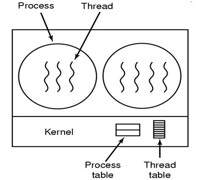
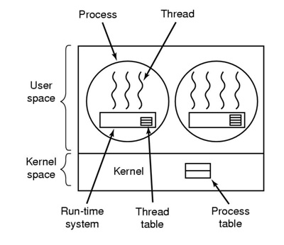

# Aula 08

## Threads

Da [Wikipedia](https://pt.wikipedia.org/wiki/Thread_(computa%C3%A7%C3%A3o)):

> Uma ***thread*** é a menor sequência de instruções programadas que pode ser gerenciada independentemente por um agendador (*scheduler*), que normalmente faz parte do sistema operacional. Em muitos casos, uma ***thread*** é um componente de um processo.
>
> As múltiplas ***threads*** de um determinado processo podem ser executadas concorrentemente (através de recursos de *multithreading*), compartilhando recursos como **memória**, enquanto processos diferentes não compartilham esses recursos. Em particular, as ***threads*** de um processo **compartilham** seu **código executável** e os **valores de suas variáveis ​​alocadas dinamicamente** e **variáveis ​​globais não locais da *thread*** em qualquer momento.
>
> O suporte à *thread* é fornecido pelo sistema operacional no caso da linha de execução ao nível do núcleo (em inglês: *Kernel-Level Thread*, KLT), ou implementada através de uma biblioteca de uma determinada linguagem de programação (*User-Level Thread*, ULT). Uma thread permite, por exemplo, que o utilizador de um programa utilize uma funcionalidade do ambiente enquanto outras linhas de execução realizam outros cálculos e operações.
>
> Os sistemas que suportam uma única *thread* (em real execução) são chamados de ***single-thread*** enquanto que os **sistemas que suportam múltiplas *threads*** são chamados de ***multithread*** (multitarefa).

<div style="display:flex; justify-content: center; align-items: center; gap: 10px;">
<figure style="max-width: 100%; height: auto;">
    
    <figcaption><i>Thread</i> em modo kernel.</figcaption>
</figure>

<figure style="max-width: 100%; height: auto;">
    
    <figcaption><i>Thread</i> em modo usuário.</figcaption>
</figure>
</div>

## O problema da Interface Gráfica travada

Aplicações baseadas em Qt  são baseadas em **eventos**. Isso significa que a execução é orientada a eventos em resposta à interação do usuário, sinais e temporizadores. Em uma aplicação orientada a eventos, clicar em um botão cria um evento que a aplicação processa para produzir a saída esperada. Os **eventos são adicionados e removidos de uma fila de eventos e processados ​​sequencialmente**.

No PySide6 criamos uma aplicação com o seguinte código

```python
app = QApplication([])
window = MainWindow()
app.exec()
```

O loop de eventos (*event loop*) inicia quando se chama o método `.exec()` no objeto `QApplication`, e é executado na mesma ***thread*** do código Python. A ***thread*** que executa esse loop de eventos — geralmente chamada de ***thread*** da GUI — também lida com toda a comunicação da janela com o sistema operacional.

Por padrão, qualquer execução acionada pelo loop de eventos também será executada de forma **síncrona** dentro desta ***thread***. Na prática, isso significa que durante o tempo em que o aplicativo PySide6 fica realizando alguma tarefa, a comunicação com a janela e a interação com a interface gráfica ficam congeladas.

Se o programa for simples e retornar o controle ao loop da interface gráfica rapidamente, o congelamento da interface será imperceptível para o usuário. No entanto, se for necessário executar tarefas mais demoradas, como abrir e gravar um arquivo grande, baixar dados ou renderizar uma imagem de alta resolução, haverá problemas.

Para o usuário, o aplicativo parecerá não responder (porque não vai responder mesmo). Ninguém quer isso. A solução é mover as tarefas de longa duração da ***thread*** da GUI para outra ***thread***, e o PySide6 fornece uma interface simples para isso.

### [Exemplo](./exemplos/exemplo01.py) da GUI sendo travada

```python
import time

from PySide6.QtCore import QTimer
from PySide6.QtWidgets import (
    QApplication,
    QLabel,
    QMainWindow,
    QPushButton,
    QVBoxLayout,
    QWidget,
)

class MainWindow(QMainWindow):
    def __init__(self, *args, **kwargs):
        super().__init__(*args, **kwargs)
        self.counter = 0

        layout = QVBoxLayout()

        self.label = QLabel("Início")

        # ATENÇÃO AQUI --------------------
        button = QPushButton("PRE-RI-GO!")
        button.pressed.connect(self.oh_no)
        #----------------------------------

        layout.addWidget(self.label)
        layout.addWidget(button)

        w = QWidget()
        w.setLayout(layout)
        self.setCentralWidget(w)

        # Outra possibilidade de fazer a Janela Principal ser mostrada
        self.show() # A LINHA 32

        # ATENÇÃO AQUI ----------------------------------
        self.timer = QTimer()
        self.timer.setInterval(1000)
        self.timer.timeout.connect(self.recurring_timer)
        self.timer.start()
        #------------------------------------------------

    def oh_no(self):
        time.sleep(5)

    def recurring_timer(self):
        self.counter += 1
        self.label.setText(f"Counter: {self.counter}")


app = QApplication([])
window = MainWindow()
# Aqui não tem window.show() por causa da linha 32
app.exec()
```

O que parece ser uma interface travada é, na verdade, o *loop* de eventos sendo bloqueado de processar e responder a eventos de janela. Os eventos ainda são registrados pelo Sistema Operacional e enviados à aplicação, mas por causa do **evento "bloqueante"**, a aplicação não pode aceitar ou reagir aos demais eventos.

## Usando ***threads*** no PySide6

O Qt fornece uma interface simples para executar tarefas ou trabalhos em outras ***threads***, que é bem suportada no PySide6. Essa interface é construída em torno de duas classes:

- [`QRunnable`](https://doc.qt.io/qtforpython-6/PySide6/QtCore/QRunnable.html): o container para cada tarefa (*work*).
- [`QThreadPool`](https://doc.qt.io/qtforpython-6/PySide6/QtCore/QThreadPool.html): o método pelo qual a tarefa (*work*) será passada para ***threads*** alternativas.

A grande vantagem de usar o `QThreadPool` é que ele **gerencia** o enfileiramento e a execução dos `workers` (os containeres das tarefas/*works*) para você. Além de enfileirar as tarefas e recuperar os resultados, não há muito mais a fazer.

Se aplicarmos isso no exemplo da GUI sendo travada, teremos o seguinte [código](./exemplos/exemplo02.py):

```python
import time
from PySide6.QtCore import QRunnable, QThreadPool, QTimer, Slot
from PySide6.QtWidgets import (QApplication, QLabel, QMainWindow,
    QPushButton, QVBoxLayout, QWidget)

# ATENÇÃO AQUI --------------------------------------------
class Worker(QRunnable):
    """Thread de tarefa/trabalho."""

    @Slot()
    def run(self):
        """A tarefa de longa execução."""
        print("Thread iniciada")
        time.sleep(5)
        print("Thread completa")
#----------------------------------------------------------

class MainWindow(QMainWindow):
    def __init__(self):
        super().__init__()
        self.counter = 0

        layout = QVBoxLayout()

        self.label = QLabel("Início")
        # ATENÇÃO AQUI ---------------------
        button = QPushButton("PRE-RI-GO!")
        button.pressed.connect(self.oh_no)
        #-----------------------------------

        layout.addWidget(self.label)
        layout.addWidget(button)

        w = QWidget()
        w.setLayout(layout)
        self.setCentralWidget(w)

        self.show()

        # ATENÇÃO AQUI ------------------------------------
        self.timer = QTimer()
        self.timer.setInterval(1000)
        self.timer.timeout.connect(self.recurring_timer)
        self.timer.start()

        self.threadpool = QThreadPool()
        thread_count = self.threadpool.maxThreadCount()
        print(f"Multithreading com o máximo de {thread_count} threads")
        #--------------------------------------------------

    # ATENÇÃO AQUI ----------------------------------------
    def oh_no(self):
        worker = Worker()
        self.threadpool.start(worker)
    #--------------------------------------------------

    def recurring_timer(self):
        self.counter += 1
        self.label.setText(f"Counter: {self.counter}")


app = QApplication([])
window = MainWindow()
app.exec()
```

Clique [aqui](./exemplos/exemplo03.py) para ver um exemplo mais completo e complexo.

## Usando ***threads*** nativas do Python

Agora o mesmo [exemplo](./exemplos/exemplo04.py) anterior (sem ser o completo), porém utilizado ***threads*** a partir do módulo nativo do Python, em vez das classes fornecidas pelo PySide6.

```python
import threading
import time
from PySide6.QtCore import QTimer
from PySide6.QtWidgets import (QApplication, QLabel, QMainWindow,
    QPushButton, QVBoxLayout, QWidget)

# ATENÇÃO AQUI -----------------------------
#   Não é necessária a subclasse de QRunnable
def tarefa_demorada():
    """A tarefa de longa execução."""
    print("Thread iniciada")
    time.sleep(5)
    print("Thread completa")
#-------------------------------------------

class MainWindow(QMainWindow):
    def __init__(self):
        super().__init__()
        self.counter = 0

        layout = QVBoxLayout()

        self.label = QLabel("Início")
        # ATENÇÃO AQUI ---------------------
        button = QPushButton("PRE-RI-GO!")
        button.pressed.connect(self.oh_no)
        #-----------------------------------

        layout.addWidget(self.label)
        layout.addWidget(button)

        w = QWidget()
        w.setLayout(layout)
        self.setCentralWidget(w)

        self.show()

        self.timer = QTimer()
        self.timer.setInterval(1000)
        self.timer.timeout.connect(self.recurring_timer)
        self.timer.start()

    # ATENÇÃO AQUI ----------------------------------------
    def oh_no(self):
        # daemon = True
        #   Garante que as threads não impeçam o encerramento do programa se a janela for fechada enquanto a tarefa ainda está rodando. Sem isso, o processo esperaria as threads terminarem.
        thread = threading.Thread(target=tarefa_demorada, daemon=True)
        # Iniciando a thread
        thread.start()
        print(f"Threads ativas: {threading.active_count()}")
    #------------------------------------------------------

    def recurring_timer(self):
        self.counter += 1
        self.label.setText(f"Counter: {self.counter}")


app = QApplication([])
window = MainWindow()
app.exec()
```

Caso queira ver o exemplo completo e complexo com *threads* nativas, clique [aqui](./exemplos/exemplo05.py).