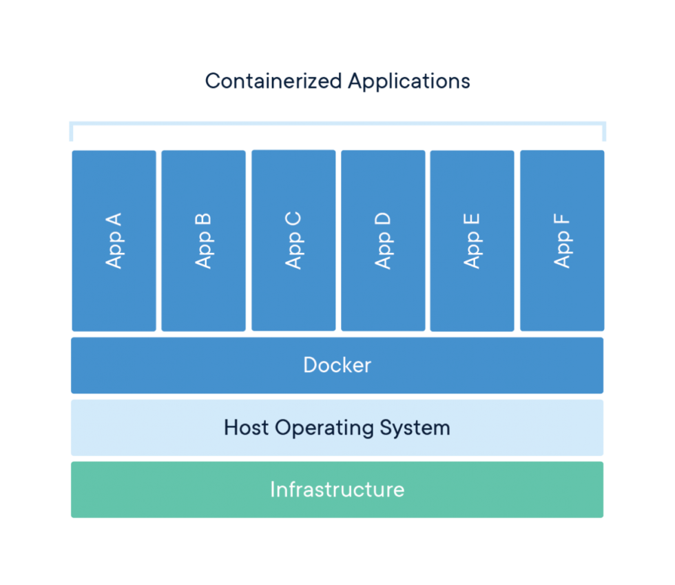
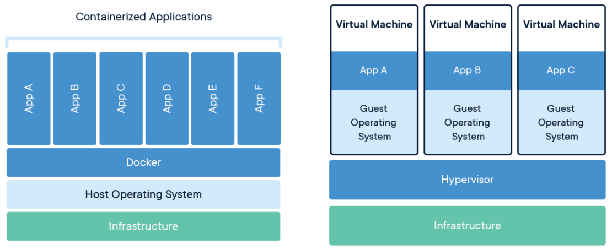

# Aula 09

## Docker

O `Docker` é uma plataforma aberta para **desenvolver**, **distribuir** e **executar** aplicações. O `Docker` permite **separar** suas aplicações da sua infraestrutura, possibilitando a entrega rápida de software. Ele permite empacotar e executar uma aplicação em um ambiente **parcialmente isolado**, chamado `contêiner`. O isolamento e a segurança permitem executar vários `contêineres` simultaneamente em um mesmo host.

Um `contêiner` é uma unidade padrão de software que **empacota** o código e todas as suas dependências, permitindo que o aplicativo seja executado de forma rápida e confiável em **diferentes ambientes computacionais**. 

<figure style="text-align:center;">
  
</figure>

Em outras palavras, `contêineres` são **processos isolados para cada componente** de uma aplicação. Cada componente (por exemplo, uma aplicação *front-end* com React, *back-end* API com Python, e um banco de dados) é executado em seu próprio ambiente isolado, e completamente isolado do restante de sua máquina.

<figure style="text-align:center;">
  
  <figcaption>Diferença entre contêneres e Máquinas Virtuais</figcaption>
</figure>

Uma **imagem de contêiner** Docker é um pacote de software leve, **independente** e **executável**, que **inclui tudo o que é necessário para executar um aplicativo**: código, ambiente de execução, ferramentas de sistema, bibliotecas de sistema e configurações.