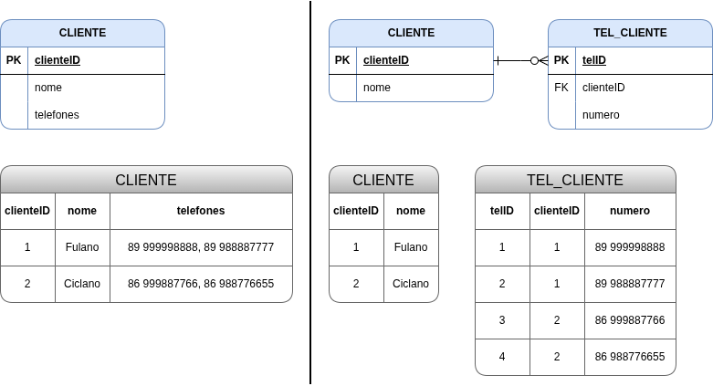
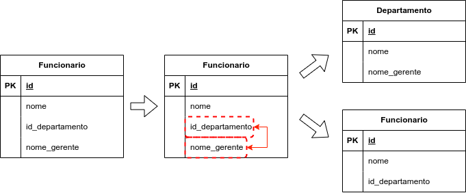
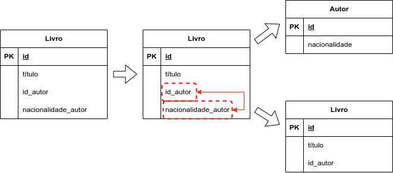
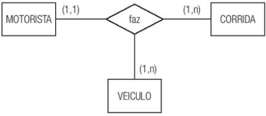
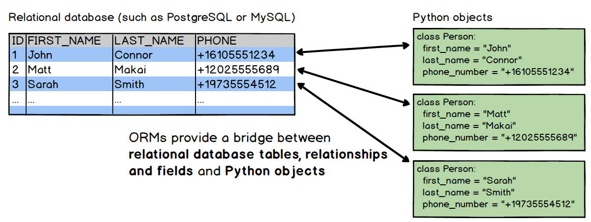

# Aula 10

**Sumário**

- [Aula 10](#aula-10)
  - [1. Bancos de Dados Relacionais - Revisão\[^1\]](#1-bancos-de-dados-relacionais---revisão1)
    - [1.1. Transações](#11-transações)
    - [1.2. ACID](#12-acid)
    - [1.3. Domínios e Esquemas](#13-domínios-e-esquemas)
    - [1.4. Modelo Entidade-Relacionamento (MER)](#14-modelo-entidade-relacionamento-mer)
      - [1.4.1. Entidades](#141-entidades)
      - [1.4.2. Relacionamentos](#142-relacionamentos)
    - [1.5. Diagrama de Entidade-Relacionamento](#15-diagrama-de-entidade-relacionamento)
  - [2. Normalização](#2-normalização)
    - [2.1. Primeira Forma Normal](#21-primeira-forma-normal)
      - [Exemplo 1](#exemplo-1)
      - [Exemplo 2](#exemplo-2)
      - [Exemplo 3](#exemplo-3)
    - [2.2. Segunda Forma Normal](#22-segunda-forma-normal)
    - [2.3. Terceira Forma Normal](#23-terceira-forma-normal)
    - [2.4. Forma Normal de Boyce-Codd](#24-forma-normal-de-boyce-codd)
    - [2.5. Quarta Forma Normal](#25-quarta-forma-normal)
    - [2.6. Quinta Forma Normal](#26-quinta-forma-normal)
  - [3. Exemplos de BDs](#3-exemplos-de-bds)
    - [3.1. SQLite](#31-sqlite)
    - [3.2. PostgreSQL](#32-postgresql)
    - [3.3. MySQL](#33-mysql)
    - [3.4. Tabela comparativa](#34-tabela-comparativa)
  - [4. *Object-relational Mappers* (ORMs) \[^1\]](#4-object-relational-mappers-orms-1)
    - [4.1. A utilidade dos ORMs](#41-a-utilidade-dos-orms)
    - [4.2. Desvantagens dos ORMs](#42-desvantagens-dos-orms)
    - [4.3. ORMs em Python](#43-orms-em-python)


## 1. Bancos de Dados Relacionais - Revisão[^1]

[^1]: Traduzido e adaptado de https://grokipedia.com/page/Relational_database

Um Banco de Dados Relacional é um tipo de Sistema de Gerenciamento de Banco de Dados (**SGBD**) que organiza os dados em relações, as quais consistem em estruturas tabulares contendo linhas (**tuplas**) e colunas (**atributos**), aderindo ao modelo relacional introduzido por [Edgar F. Codd](https://grokipedia.com/page/Edgar_F._Codd) em 1970. Esse modelo representa os dados como conjuntos de relações onde cada relação é composta por **entidades** e suas **associações** através de atributos compartilhados, o que permite o armazenamento, recuperação e manipulação eficientes sem depender de detalhes de armazenamento físico.

Os princípios fundamentais de bancos de dados relacionais enfatizam a [**independência dos dados**](https://grokipedia.com/page/Data_independence), [**integridade**](https://grokipedia.com/page/Data_integrity) e **consulta declarativa**. 

- A independência lógica dos dados garante que mudanças no esquema conceitual, como a adição de novas relações, não afetam programas que estejam usando o banco. A independência física dos dados protege os usuários contra alterações nas estruturas de armazenamento ou nos métodos de acesso.
- A integridade dos dados é garantida por meio de restrições como **chaves primárias**, as quais identificam **exclusivamente** cada tupla em uma relação, e **regras de integridade referencial**, as quais mantêm a consistência através das relações.
- As consultas consistem em operações sobre conjuntos como **seleção**, **projeção** e **junção**, as quais tratam os dados como conjuntos matemáticos, o que permite aos usuários especificar quais dados são necessários sem a necessidade de detalhar como recuperá-los.

### 1.1. Transações

Uma **transação** é definida como um **[unidade de trabalho](https://grokipedia.com/page/Unit_of_work) lógica** consistindo em uma sequência de operações, como leitura e escrita, as quais são executadas como uma entidade única e indivisível de forma a manter a integridade dos dados.

As transações normalmente começam com uma declaração `BEGIN`, seguida de uma série de operações de banco de dados, sendo concluídas com um `COMMIT`, para aplicar permanentemente as mudanças, ou um `ROLLBACK` para desfazê-las, o que garante que falhas parciais não deixem o banco de dados em um estado inconsistente. Esse mecanismo permite que operações complexas, como a transferência de fundos entre contas, sejam tratadas **atomicamente**, prevenindo situações problemáticas caso haja falha em alguma operação.

### 1.2. ACID

The reliability of transactions in relational databases is ensured through the ACID properties (atomicity, consistency, isolation, durability), a set of guarantees that ensure reliable transaction processing; the acronym was coined by Theo Härder and Andreas Reuter in 1983.[67] Atomicity requires that a transaction is executed completely or not at all; if any operation fails, the entire transaction is rolled back, restoring the database to its pre-transaction state. Consistency mandates that a transaction brings the database from one valid state to another, preserving integrity constraints such as primary keys, foreign keys, and check constraints after completion. Isolation ensures that concurrent transactions do not interfere with each other, making each transaction appear to execute in isolation even when running in parallel. Durability guarantees that once a transaction is committed, its effects are permanently stored, surviving subsequent system failures through techniques like write-ahead logging.

A confiabilidade das transações em um banco de dados relacional é garantido atraveás das propriedades **ACID**:

- **A**tomicidade: requer que uma transação seja executada por completo; se alguma operação falhar, a transação inteira é revertida, levando o banco de dados para seu estado anterior à transação.
- **C**onsistência: exige que uma transação leve o banco de dados de um estado válido para outro, preservando as restrições de integridade, como chaves primárias, chaves estrangeiras e restrições de verificação, após a conclusão.
- **I**solamento: garante que as transações simultâneas não interfiram umas com as outras, fazendo com que cada transação pareça ser executada isoladamente, mesmo quando em paralelo.
- **D**urabilidade: garante que, uma vez confirmada uma transação, seus efeitos sejam armazenados permanentemente, sobrevivendo a falhas subsequentes do sistema.

### 1.3. Domínios e Esquemas

Um domínio representa o conjunto de valores atômicos permitidos a partir dos quais os valores de um atributo específico são extraídos, garantindo a consistência dos dados e a segurança de tipos entre as relações. Esse conceito, introduzido por E.F. Codd, define domínios como conjuntos finitos ou infinitos de valores, como o domínio dos inteiros para atributos numéricos ou o domínio das strings para atributos textuais, impedindo entradas inválidas, como valores não numéricos em um campo de idade. Por exemplo, o domínio para o atributo de idade de um funcionário pode ser restrito a inteiros entre 18 e 65, limitando os valores a esse intervalo e excluindo dados estranhos, como números negativos ou decimais.

O esquema (*scheme*) define a estrutura básica, compreendendo esquemas de relação que especificam os atributos de cada tabela juntamente com seus domínios associados, e o esquema geral do banco de dados como a coleção integrada desses esquemas de relação, incluindo definições para **visões** (*views*), **índices** e **restrições** (*constraints*), quando aplicável. Os **esquemas de relação** servem, portanto, como descritores fundamentais, nomeando a tabela e mapeando cada atributo ao seu domínio, enquanto o **esquema do banco de dados** fornece uma visão holística da organização entre as tabelas sem se aprofundar nas instâncias de dados. Essa separação permite um design abstrato independente do armazenamento físico, facilitando a manutenção e a escalabilidade em sistemas de grande porte.

### 1.4. Modelo Entidade-Relacionamento (MER)

O **Modelo Entidade-Relacionamento** (MER) é a base do design de bancos de dados relacionais. Ele serve como uma planta arquitetônica, descrevendo a estrutura lógica dos dados de forma independente de como eles serão implementados fisicamente. Seus dois principais componentes são as **entidades** e seus **relacionamentos**.

#### 1.4.1. Entidades

Representam objetos do mundo real (ex: Cliente, Produto) ou conceitos abstratos (ex: Venda). As entidades têm suas características descritas através de diferentes tipos de **atributos**:

- **Atributo Simples**: Indivisível (ex: CPF, Idade).
- **Atributo Composto**: Pode ser dividido em partes menores (ex: Endereço, que se divide em Rua, Número, CEP).
- **Atributo Monovalorado**: Possui apenas um valor para uma instância (ex: Data de Nascimento).
- **Atributo Multivalorado**: Pode ter vários valores (ex: Telefone, Habilidades). Geralmente representado por uma elipse dupla.
- **Atributo Derivado**: Seu valor depende de outro atributo (ex: Idade, que é calculada a partir da Data de Nascimento). Representado por uma elipse tracejada.
- **Atributo Chave (Identificador)**: Identifica unicamente uma instância da entidade (ex: ID_Cliente). Texto sublinhado.

#### 1.4.2. Relacionamentos

Descrevem como as entidades interagem entre si (ex: Cliente compra Produto). Podem classificados de acordo com o **grau** (número de entidades envolvidas) e de acordo com sua **cardinalidade** (número de instâncias de uma entidade que podem estar associadas a instâncias de outra entidade).

De acordo com o grau:

- **Unário (Auto-relacionamento)**: Uma entidade se relaciona com ela mesma (ex: Empregado gerencia Empregado).
- **Binário**: Envolve duas entidades (o mais comum).
- **Ternário**: Envolve três entidades simultaneamente (ex: Fornecedor, Peça e Projeto).

De acordo com a cardinalidade:

- **1:1 (Um para Um)**: Cada registro de A se relaciona com apenas um de B.
- **1:N (Um para Muitos)**: Um registro de A pode se relacionar com vários de B.
- **N:N (Muitos para Muitos)**: Vários registros de A se relacionam com vários de B.

### 1.5. Diagrama de Entidade-Relacionamento

O Diagrama de Entidade-Relacionamento (**DER**) é uma forma visual de representar as entidades e seus respectivos relacionamentos. Existem duas notações bastante comuns: **Peter Chen** e **Pé de Galinha** (ou *Crow's foot*).

A Notação de Peter Chen é comumente associada à **fase conceitual**, pois foca na semântica. É excelente para discutir o modelo com pessoas que não são da área técnica, pois usa formas geométricas para separar claramente o que é objeto, ação e característica.

A Notação de Pé de Galinha é mais associada à **fase lógica**. É mais "limpa" para diagramas complexos porque os atributos ficam dentro dos retângulos e a cardinalidade é representada por símbolos nas extremidades das linhas.

Comparativo das estruturas:

<figure style="text-align:center;">
    
</figure>

## 2. Normalização

> **Normalização** é um procedimento que examina e **simplifica os atributos** de uma entidade com o objetivo de **evitar anomalias** que possam ocorrer na inclusão, na exclusão ou na alternação de uma ocorrência especı́fica em uma entidade.

Anomalias:

1. **Anomalia de Inserção**: Impedir que você seja incapaz de inserir um dado porque falta outra informação (ex: não conseguir cadastrar um curso porque ainda não há alunos).
2. **Anomalia de Exclusão**: Evitar que, ao deletar um registro, informações importantes e não relacionadas sejam perdidas.
3. **Anomalia de Alteração**: Garantir que, ao mudar um dado (como o preço de um produto), você não precise atualizar centenas de linhas manualmente, correndo o risco de deixar dados inconsistentes.

Ao longo do tempo (a partir de 1970 até 2003) foram propostas **10 formas normais**. Entretanto, um banco de dados relacional que tenha alcançado os critérios da **Terceira Forma Normal**, já pode ser considerado normalizado, pois estará livre das anomalias de adição, edição e inclusão de dados.

As formas normais:

- Primeira Forma Normal - **1FN**.
- Segunda Forma Normal - **2FN**.
- Terceira Forma Normal - **3FN**.
- Forma Normal de Chave Elementar - **FNCE**.
- Forma Normal de Boyce-Codd - **FNBC**.
- Quarta Forma Normal - **4FN**.
- Forma Normal de Tupla Essencial - **FNTE**.
- Quinta Forma Normal - **5FN**.
- Forma Normal de Chave de Domı́nio - **FNCD**.
- Sexta Forma Normal - **6FN**.

### 2.1. Primeira Forma Normal

A **1FN** estabelece que uma entidade está em conformidade se:

- Não possui atributos multivalorados ou grupos repetitivos, ou seja, os valores dos atributos devem ser **atômicos** (ou **indivisíveis**).
- Todos os atributos estão no formato atômico, ou seja, não são compostos por múltiplas partes.
- Existe uma chave primária que identifica apenas uma ocorrência.
- As ocorrências da entidade são todas distintas entre si.

Para normalizar é necessário:

1. **Identificar** a(s) **coluna**(s) que possui(em) dados multivalorados e compostos, e **removê-la**(s).
2. **Construir outra tabela** (ou seja, outra entidade) com o atributo identificado e removido e, em seguida, estabelecendo uma relação entre as duas entidades.

#### Exemplo 1

- **Antes**: `CLIENTE(clienteID, nome, telefones)`
  | clienteID | nome | telefones |
  |---|---|---|
  | 1 | Fulano | 89 999998888, 89 988887777 |
  | 2 | Cicrano | 86 999887766, 86 988776655 |
- **Depois**: `CLIENTE(clienteID, nome)` **1:N** `TEL_CLIENTE(telID, clienteID_FK, numero)`
  | clienteID | nome |
  |---|---|
  | 1 | Fulano |
  | 2 | Cicrano |

  | telID | clienteID | numero |
  |---|---|---|
  | 1 | 1 | 89 999998888 |
  | 2 | 1 | 89 988887777 |
  | 3 | 2 | 86 999887766 |
  | 4 | 2 | 86 988776655 |

<figure style="text-align:center;">
  
  <figcaption>DER do Exemplo 1</figcaption>
</figure>

#### Exemplo 2

- **Antes**: `LOJA(lojaID, nome, endereco_completo)`
  | **lojaID** | **nome** | **endereco_completo** |
  |---|---|---|
  | 1 | Shopeecos | Rua A, bairro B, Picos, PI |
  | 2 | PicosExpress | Rua B, bairro C, Picos, PI |
- **Depois**: `LOJA(lojaID, nome, logradouro, bairro, cidade, uf)`
  | **lojaID** | **nome** | **logradouro** | **bairro** | **cidade** | **uf** |
  |---|---|---|---|---|---|
  | 1 | Shopeecos | Rua A | B | Picos | PI |
  | 2 | PicosExpress | Rua B | C | Picos | PI |

#### Exemplo 3

- **Antes**: `PEDIDO(pedidoID, data, itens)`
  | **pedidoID** | **data** | **itens** |
  |---|---|---|
  | 1 | 2026-03-11 | 1xProd. 1, 2xProd. 2, 1xProd. 3 |
  | 2 | 2026-03-12 | 2xProd. 1, 1xProd. 4, 3xProd. 5 |

- **Depois**: `PEDIDO(pedidoID, data)` **1:N** `ITEM_PEDIDO(itemID, pedidoID_FK, produtoID_FK, qtd)`
  | **pedidoID** | **data** |
  |---|---|
  | 1 | 2026-03-11 |
  | 2 | 2026-03-12 |

  | **itemID** | **pedidoID_FK** | **produtoID_FK** | **qtd** |
  |---|---|---|---|
  | 1 | 1 | 1 | 1 |
  | 2 | 1 | 2 | 2 |
  | 3 | 1 | 3 | 1 |
  | 4 | 2 | 1 | 2 |
  | 5 | 2 | 4 | 1 |
  | 6 | 2 | 5 | 3 |

### 2.2. Segunda Forma Normal

Uma entidade está em conformidade com a Segunda Forma Normal (**2FN**) se:

- Estiver na 1FN.
- Todos os atributos não chave **dependem totalmente** da chave primária (PK).

Para normalizar é necessário:

- **Identificar** os **atributos** que não dependem totalmente da chave primária.
- **Construir nova(s) tabela(s)** para que os atributos dependam totalmente de suas chaves.

Exemplos:

<div style="text-align: center;">
    
    
    
</div>

### 2.3. Terceira Forma Normal

Uma entidade está em conformidade com a Terceira Forma Normal (**3FN**) se:

- Estiver na 2FN.
- Não haja dependências transitivas (atributos não-chave dependendo de outros não-chave).

Para normalizar é necessário:

- **Identificar** os **atributos** que não dependem totalmente da chave primária.
- **Construir nova(s) tabela(s)** para que os atributos dependem somente de suas chaves.

Exemplos:

<div style="text-align: center;">
    <br>
    <br>
    
</div>

### 2.4. Forma Normal de Boyce-Codd

Uma entidade está em conformidade com a Forma Normal de Boyce-Codd (**FNBC**) se:

- Estiver na 3FN.
- Para toda `dependência funcional` $X \rightarrow Y$, $X$ é `superchave`.
  - Isso significa que $X$ (também chamado de **determinante**) precisa ser uma `chave candidata` da tabela.

**Conceitos**:
- Dada uma relação $R$ e um conjunto de atributos $X, Y \subseteq R$, é dito que $X$ **determina funcionalmente** $Y (X \rightarrow Y)$ se cada valor de $X$ é associado com precisamente um valor de $Y$. Duas **tuplas**  que possuem os mesmos valores de $X$ necessariamente terão os mesmos valores de $Y$.
- `superchave`: qualquer **conjunto de atributos** que identifica exclusivamente uma tupla de uma.
- `chave candidata`: o conjunto com a menor quantidade de atributos necessários para identificar exclusivamente uma tupla.

Para normalizar é necessário:

- **Identificar** as **dependências funcionais** onde o **determinante** não é chave candidata.
- **Construir nova(s) tabela(s)** para que o(s) determinante(s) seja(m) chave candidata.

Exemplo: tabela `Matricula(EstudanteID, Disciplina, Professor)`

| **EstudanteID** | **Disciplina** | **Professor** |
|---|---|---|
| 1234 | SISTEMAS INTELIGENTES | ROMUERE SILVA |
| 1221 | PROGRAMAÇÃO PARA A WEB I | EVANDRO SILVA |
| 1234 | GERÊNCIA DE PROJETOS | EVANDRO SILVA |
| 1201 | ALGORITMOS E PROGRAMAÇÃO I | ALCILENE DE SOUSA |
| 1201 | LÓGICA PARA COMPUTAÇÃO | JOSÉ DENES ARAÚJO |

- **Chaves candidatas**: {`EstudanteID`, `Disciplina`} e {`EstudanteID`, `Professor`}

- **Dependências funcionais**
  - {`EstudanteID`, `Professor`} $\rightarrow$ `Disciplina`.
  - {`EstudanteID`, `Disciplina`} $\rightarrow$ `Professor`.
  - `Disciplina` $\rightarrow$ `Professor`
    - `Disciplina` **não é chave candidata**.

**Solução**:

- Tabela `Disciplina`
  | **Disciplina** (PK) | **Professor** |
  |---|---|
  | SISTEMAS INTELIGENTES | ROMUERE SILVA |
  | PROGRAMAÇÃO PARA A WEB I | EVANDRO SILVA |
  | GERÊNCIA DE PROJETOS | EVANDRO SILVA |
  | ALGORITMOS E PROGRAMAÇÃO I | ALCILENE DE SOUSA |
  | LÓGICA PARA COMPUTAÇÃO | JOSÉ DENES ARAÚJO |

- Tabela `Matricula`
  | **EstudanteID** (PK) | **Disciplina** (PK/FK) |
  |---|---|
  | 1234 | SISTEMAS INTELIGENTES |
  | 1221 | PROGRAMAÇÃO PARA A WEB I |
  | 1234 | GERÊNCIA DE PROJETOS |
  | 1201 | ALGORITMOS E PROGRAMAÇÃO I |
  | 1201 | LÓGICA PARA COMPUTAÇÃO |

### 2.5. Quarta Forma Normal

Uma entidade está em conformidade com a Quarta Forma Normal (**4FN**) se:

- Estiver na FNBC.
- Não contiver **dependências multivaloradas não triviais**.

Exemplo (entidade `Funcionario`):

| **FuncionarioID** | **Habilidade** | **Idioma** |
|---|---|---|
| 1 | Jiujitsu | Português |
| 1 | Aikido | Japonês |
| 2 | Karate | Inglês |
| 3 | Krav-Magá | Hebraico |

A partir de `Funcionario` teremos as entidades `Habilidade` e `Idioma`. Além dessas duas, outras entidades para o mapeamento entre `Funcionario`, `Habilidade` e `Idioma`.

Entidade `Habilidade`:

| **HabilidadeID** | **Nome** |
|---|---|
| 1 | Jiujitsu |
| 2 | Aikido |
| 3 | Karate |
| 4 | Krav-Magá |

Entidade `Idioma`:

| **IdiomaID** | **Nome** |
|---|---|
| 1 | Português |
| 2 | Japonês |
| 3 | Inglês |
| 4 | Hebraico |

Entidade `Funcionario_Habilidade`:

| **FuncionarioID** | **HabilidadeID** |
|---|---|
| 1 | 1 |
| 1 | 2 |
| 2 | 3 |
| 3 | 4 |

Entidade `Funcionario_Idioma`:

| **FuncionarioID** | **IdiomaID** |
|---|---|
| 1 | 1 |
| 1 | 2 |
| 2 | 3 |
| 3 | 4 |

### 2.6. Quinta Forma Normal

Uma entidade está em conformidade com a Quinta Forma Normal (**5FN**) se:

- Estiver na 4FN.
- O conteúdo de cada ocorrência não puder ser reconstruı́do a partir de ocorrências menores.

Deve ser aplicada sempre que existirem relacionamentos ternários ou n-ários, com o objetivo de reduzir os relacionamentos ao nível binário.

Exemplo:

<div style="text-align: center;">
        
</div>

Pode ser reorganizado da seguinte forma:

<div style="text-align: center;">
    
</div>

Entidades:

- `Veiculo(id, marca, ano, ...)`.
- `Motorista(id, nome, cnh, ...)`.
- `Corrida(id, id_veiculo_fk, id_motorista_fk)`.

## 3. Exemplos de BDs

### 3.1. [SQLite](https://sqlite.org/index.html)

<figure style="text-align:center;">
  
</figure>

O SQLite é uma biblioteca de software, escrita em C, que fornece um sistema de gerenciamento de banco de dados relacional (RDBMS). Diferente da maioria dos outros bancos de dados (como MySQL ou PostgreSQL), ele não funciona como um processo de servidor separado, ou seja, o motor (ou *engine*) do banco reside dentro da própria aplicação. O banco de dados inteiro — tabelas, índices e os próprios dados — é armazenado em um único arquivo comum no disco.

**Principais características**:

- **Serverless** (Sem Servidor): Não requer um processo de servidor separado ou sistema para operar. O acesso ao arquivo é feito diretamente pela biblioteca integrada ao código.
- **Configuração Zero**: Não há necessidade de instalar, configurar ou gerenciar usuários e permissões complexas antes de começar a usar.
- **Transacional** (ACID): Mesmo sendo leve, ele garante que todas as transações sejam seguras. Se houver uma queda de energia ou erro no sistema, os dados permanecem íntegros.
- **Multiplataforma**: O arquivo do banco de dados é altamente portável. Você pode criar um banco no Windows e movê-lo para um Mac, Linux ou Android sem qualquer conversão.
- **Pequeno**: A biblioteca completa é muito leve (geralmente menos de 1MB), consumindo poucos recursos de memória e CPU.

**Por que/quando usar**:

- **Desenvolvimento de Aplicativos Móveis**: É o padrão ouro para Android e iOS. Quase todos os apps que salvam dados localmente no seu celular usam SQLite.
- **Aplicações Desktop**: Ideal para softwares que precisam salvar preferências de usuário ou grandes catálogos de informações sem forçar o usuário a instalar um servidor SQL.
- **Internet das Coisas (IoT)**: Por ser extremamente econômico em termos de hardware, é perfeito para dispositivos inteligentes e sistemas embarcados.
- **Formato de Arquivo de Aplicativo**: Muitos programas usam o SQLite como seu formato de arquivo principal (em vez de arquivos XML ou JSON), permitindo buscas complexas e proteção contra corrupção de dados.
- **Testes e Prototipagem**: Ótimo para desenvolvedores web que querem criar um protótipo rápido sem perder tempo configurando infraestrutura de banco de dados pesada.

### 3.2. [PostgreSQL](https://www.postgresql.org/)

<figure style="text-align:center;">
  
</figure>

O PostgreSQL (frequentemente chamado de Postgres) é amplamente considerado o sistema de banco de dados de **código aberto mais avançado e poderoso do mundo**. Diferente do SQLite, ele é um sistema Cliente-Servidor, projetado para lidar com grandes volumes de dados e alta concorrência.

Além de ser um banco de dados SQL tradicional, ele suporta conceitos mais complexos, como herança de tabelas e tipos de dados personalizados, funcionando quase como uma mistura de banco relacional com recursos de bancos NoSQL.

**Principais características**:

- **Arquitetura Cliente-Servidor**: Ele roda como um serviço centralizado. Várias aplicações ou usuários podem se conectar a ele simultaneamente através da rede.
- **Extensibilidade Absoluta**: Você pode adicionar novos tipos de dados, funções personalizadas e até escrever procedimentos em diferentes linguagens (como Python, Java ou C) dentro do banco.
- **Concorrência Avançada (MVCC)**: Utiliza o *Multi-Version Concurrency Control*, que permite que vários usuários leiam e escrevam ao mesmo tempo sem que um bloqueie o outro.
- **Conformidade Padrão**: É extremamente rigoroso com os padrões SQL e oferece suporte nativo a JSONB, permitindo armazenar e consultar dados não estruturados com altíssima performance.
- **Confiabilidade de Dados**: Possui recursos robustos de recuperação de desastres, como o *Write-Ahead Logging* (WAL) e replicação sofisticada.

**Por que/quando usar**:

- **Escalabilidade e Complexidade**: o PostgreSQL é otimizado para ambientes que demandam alta performance em operações de leitura e escrita simultâneas. Sua arquitetura processa com eficiência esquemas de dados extensos e consultas SQL de alta complexidade, mantendo a estabilidade sob cargas de trabalho elevadas.
- **Integridade de Dados Rigorosa**: em sistemas onde a fidedignidade da informação é crítica — como em aplicações financeiras ou registros governamentais —, o PostgreSQL destaca-se por sua rigorosa conformidade com as propriedades ACID. Ele oferece mecanismos avançados de restrições (*constraints*) e validações que mitigam riscos de corrupção ou inconsistência de dados.
- **Geoprocessamento (PostGIS)**: por meio da extensão PostGIS, o sistema consolida-se como a solução líder de mercado para o armazenamento e manipulação de dados geoespaciais. Ele permite a execução de análises geográficas complexas e cálculos de coordenadas com precisão milimétrica.
- **Híbrido Relacional + Documento**: A implementação do suporte nativo ao tipo JSONB permite que o PostgreSQL atue de forma híbrida. Ele oferece a flexibilidade de esquemas não estruturados (típicos de bancos NoSQL) aliada à segurança e às capacidades de indexação e consulta de um banco de dados relacional tradicional.
- **Comunidade e Ecossistema**: Sendo um projeto de código aberto com décadas de desenvolvimento contínuo, o PostgreSQL beneficia-se de um ecossistema vasto de ferramentas de terceiros, drivers otimizados e uma documentação técnica exaustiva, garantindo longevidade e suporte especializado para qualquer implementação de larga escala.

### 3.3. MySQL

<figure style="text-align:center;">
  
</figure>

O MySQL é um dos sistemas de gerenciamento de banco de dados relacionais (RDBMS) mais difundidos globalmente, fundamentado na linguagem SQL e desenvolvido sob um modelo de **código aberto**. Atualmente **mantido pela Oracle Corporation**, ele é o pilar de grande parte da infraestrutura da Web moderna.

Utiliza uma arquitetura cliente-servidor e é reconhecido por sua eficiência operacional e facilidade de integração. Ele foi projetado para oferecer alta performance em aplicações web, priorizando a velocidade de leitura e a disponibilidade do sistema.

**Principais características**:

- **Arquitetura de Motores de Armazenamento (*Storage Engines*)**: Diferente de outros RDBMS, o MySQL permite escolher entre diferentes motores (como InnoDB para transações ACID ou MyISAM para leituras rápidas), oferecendo flexibilidade conforme a carga de trabalho.
- **Replicação e Alta Disponibilidade**: Possui mecanismos nativos e robustos de replicação (Master-Slave ou Master-Master), fundamentais para a criação de sistemas redundantes e escaláveis.
- **Ecossistema Amplo**: Devido à sua longevidade e popularidade, possui integração nativa com praticamente todas as linguagens de programação e plataformas de nuvem (AWS, Azure, Google Cloud).
- **Segurança de Camadas**: Oferece um sistema de privilégios granular e robusto, permitindo o controle rigoroso de acessos e a criptografia de dados em trânsito e em repouso.

**Por que/quando usar**:

- **Otimização para Aplicações Web**: o MySQL é a escolha de referência para sistemas de gerenciamento de conteúdo (CMS) como WordPress e Drupal. Sua capacidade de processar um volume massivo de consultas de leitura de forma extremamente rápida o torna ideal para portais de conteúdo e e-commerce.
- **Facilidade de Operação e Manutenção**: comparado ao PostgreSQL, o MySQL tende a exigir uma curva de aprendizado menor para administradores de banco de dados (DBAs), com ferramentas de interface gráfica (como o MySQL Workbench) altamente maduras e intuitivas.
- **Escalabilidade Horizontal**: Através de técnicas de sharding e replicação, o MySQL permite distribuir a carga de dados entre múltiplos servidores, suportando o crescimento de aplicações que evoluem de pequenos projetos a plataformas com milhões de acessos.
- **Custo-Benefício em Infraestrutura**: por ser um padrão de mercado, o custo de hospedagem e suporte para MySQL é frequentemente mais competitivo, com uma vasta oferta de profissionais qualificados e documentação resolutiva disponível.

### 3.4. Tabela comparativa

| | **SQLite** | **PostgreSQL** | **MySQL** |
|---|---|---|---|
| **Arquitetura** |	Embutida (*Serverless*) |	Cliente-Servidor |	Cliente-Servidor |
| **Ponto Forte** |	Portabilidade e Simplicidade | Extensibilidade e Rigor | Performance Web e Replicação |
| **Concorrência** |	Baixa (1 escritor por vez) |	Altíssima (MVCC avançado) |	Alta (Otimizado p/ Leitura) |
| **Tipos de Dados** |	Limitados/Dinâmicos |	Complexos, Customizados e Geospaciais |	Padrão SQL e JSON |
| **Ideal para** |	Mobile, IoT, Desktop e Testes |	Sistemas complexos e Analíticos |	Web, CMS e Aplicações SaaS |
| **Ideal para** |	Mobile, IoT, Desktop e Testes |	Sistemas complexos e Analíticos |	Web, CMS e Aplicações SaaS |
| **Instalação** |	Zero (Arquivo único) |	Complexidade Média/Alta |	Complexidade Média |

## 4. *Object-relational Mappers* (ORMs) [^1]

[^1]: Fonte - [Full Stack Python](https://www.fullstackpython.com/object-relational-mappers-orms.html). Com edições minhas, e outros materiais.

Um ORM (*Object-Relational Mapper*) consiste em uma biblioteca que automatica a transferência de dados armazenados em tabelas de  um banco de dados relacional em objetos que são mais comumente utilizados no código.

<figure style="text-align:center;">
  
</figure>

### 4.1. A utilidade dos ORMs

ORMs fornecem uma **abstração de alto-nível** sobre uma base de dados relacional que permite a um desenvolvedor escrever código em Python (no nosso caso, mas existem ORMs para outras linguagens também) em vez de SQL para criar, ler, atualizar e excluir dados e esquemas no banco de dados.

Por exemplo, sem um ORM um desenvolver criaria o seguinte comando SQL para consultar cada linha da tabela `USERS`, onde o CEP seria 64600-000:

```sql
SELECT * FROM USERS WHERE cep='64600-000';
```

O equivalente usando o [ORM do Django](https://www.fullstackpython.com/django-orm.html) seria:

```python
users = Users.objects.filer(cep='64600-000')
```

Os ORMs também fazem com que seja **teoricamente possível alternar uma aplicação entre vários bancos de dados**. Por exemplo, um desenvolvedor pode usar SQLite localmente e o MySQL na produção. E na produção, uma aplicação poderia alternar entre MySQL e PostgreSQL com modificações mínimas.

### 4.2. Desvantagens dos ORMs

Algumas desvantagens de se utilizar ORMs são:

1. **Incompatibilidade de impedância** (*impedance mismatch*)
   - A incompatibilidade de impedância é um termo genérico para as dificuldades que ocorrem ao mover dados entre tabelas relacionais e objetos de aplicação. Em resumo, a forma como um desenvolvedor usa os objetos é diferente da forma como os dados são armazenados e combinados em tabelas relacionais. 
   - Uma boa explicação desse conceito pode ser visto [nesse artigo](http://www.agiledata.org/essays/impedanceMismatch.html).
2. **Potencial redução de desempenho**
   - Uma das preocupações que são associadas com qualquer abstração de alto-nível, ou frameworks, é o potencial da redução de desempenho. Com os ORMs, a queda de desempenho pode ocorrer na tradução do código para o comando SQL correspondente, o qual pode não estar bem ajustado.
   - Além disso, apesar de fáceis de serem utilizados os ORMs podem ser difíceis de dominar. Por exemplo, um iniciante usando Django pode não saber sobre a função `select_related()` e como ela pode melhorar consultas que envolvam relacionamento com chave estrangeira. Existem dezenas de dicas e truques sobre desempenho em cada ORM. É possível que investir tempo aprendendo essas peculiaridades seja melhor empregado aprendendo SQL e como escrever procedimentos de armazenamento.
3. **Trocar a complexidade do banco de dados pela complexidade do código**
   - Sem o uso de ORMs, os procedimentos de armazenamento costumam estar separados das regras de negócio. Com ORMs a lógica de manipulação de dados passa a ficar junto com as regras de negócio.

### 4.3. ORMs em Python

Existem várias implementações de ORMs em Python. Alguns exemplos:

1. [SQLAlchemy](https://www.fullstackpython.com/sqlalchemy.html)
2. [Peewee](https://www.fullstackpython.com/peewee.html)
3. [The Django ORM](https://www.fullstackpython.com/django-orm.html)
4. [PonyORM](https://www.fullstackpython.com/pony-orm.html)
5. [SQLObject](http://sqlobject.org/)
6. [Tortoise ORM](https://tortoise-orm.readthedocs.io/en/latest/) ([source code](https://github.com/tortoise/tortoise-orm/))
7. [ORM](https://github.com/encode/orm): um ORM leve e pronto para operações assíncronas, projetado para funcionar com FastAPI e Starlette. É particularmente adequado para aplicações que exigem operações assíncronas em bancos de dados.
8. [Gino](https://python-gino.org/): um ORM assíncrono construído sobre o núcleo do SQLAlchemy.